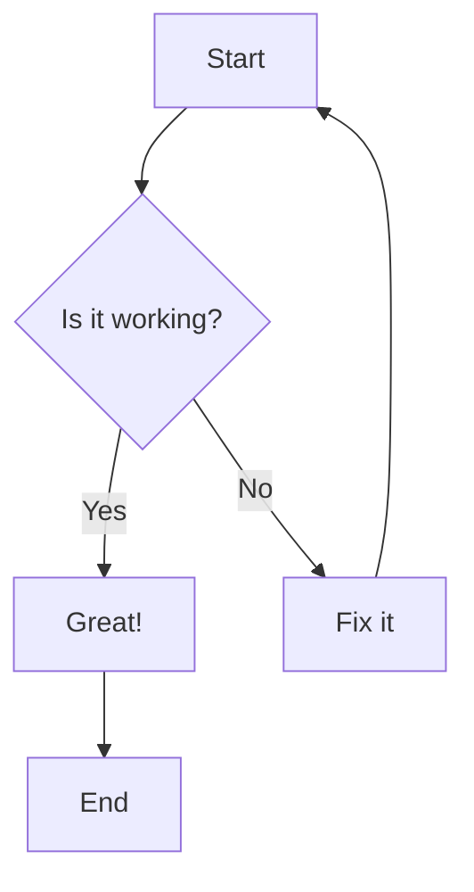
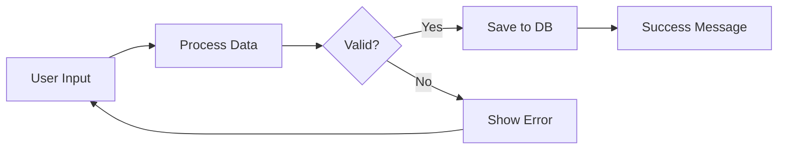
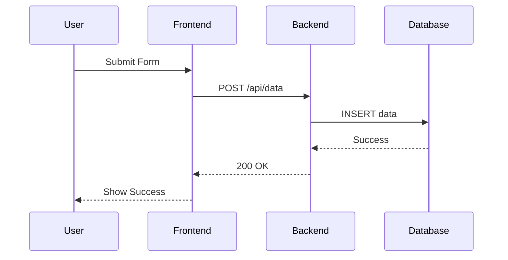

# MDX Content Creation Guide

This guide will teach you how to create and edit MDX files for your courses and presentations.

## 📁 File Structure

Your content is organized as follows:

```
courses/
├── course-name/
│   ├── _course.mdx                 # Course definition file
│   ├── lesson-1.mdx               # Individual lecture
│   ├── lesson-2.mdx               # Another lecture
│   └── lesson-1.assignment.mdx    # Optional assignment
└── another-course/
    ├── _course.mdx
    └── intro.mdx
```

## 🚀 Quick Start

### Step 1: Create a New Course

1. Create a new directory under `courses/`:

   ```bash
   mkdir courses/my-new-course
   ```

2. Create the course definition file `_course.mdx`:

   ```mdx
   ---
   title: 'My Amazing Course'
   description: 'Learn incredible things in this course'
   visible: true
   ---

   # My Amazing Course

   This course will teach you everything you need to know.

   ## What You'll Learn

   - Topic 1
   - Topic 2
   - Topic 3
   ```

### Step 2: Create Your First Lesson

Create `lesson-1.mdx`:

```mdx
---
title: 'Lesson 1 - Getting Started'
description: 'Introduction to the basics'
tags: ['introduction', 'basics']
visible: true
---

# Getting Started

## Learning Objectives

By the end of this lesson, you will:

- Understand the fundamentals
- Know how to apply concepts
- Be ready for the next lesson

## What is This About?

Your lesson content goes here...

## Key Concepts

- Important concept 1
- Important concept 2
- Important concept 3

## Summary

Today we covered the basics of...
```

## 🎨 Frontmatter Configuration

Every MDX file must start with YAML frontmatter between `---`:

```yaml
---
title: 'Your Lesson Title' # Required: Shows in navigation
description: 'Brief description' # Optional: For SEO and previews
tags: ['tag1', 'tag2', 'tag3'] # Optional: For categorization
visible: true # Optional: false to hide content
---
```

**Important Fields:**

- `title`: **Required** - Appears in navigation and page title
- `description`: **Optional** - Used for SEO and course listings
- `tags`: **Optional** - Array of tags for categorization
- `visible`: **Optional** - Set to `false` to hide content (default: `true`)

## ✍️ Content Formatting

### Headers and Structure

```markdown
# Main Title (H1) - Large title, accent color

## Section Title (H2) - Creates new slides in presentation mode

### Subsection (H3) - Medium size

#### Sub-subsection (H4) - Smaller size

##### Small heading (H5)

###### Smallest heading (H6)
```

### Text Formatting

```markdown
**Bold text** - Makes text bold
_Italic text_ - Makes text italic
`Inline code` - Highlights code snippets
~~Strikethrough~~ - Crosses out text
[Link text](https://example.com) - Creates links
```

### Lists

```markdown
Bullet lists:

- First item
- Second item
  - Nested item
  - Another nested item
- Third item

Numbered lists:

1. First step
2. Second step
   1. Sub-step
   2. Another sub-step
3. Third step
```

### Blockquotes

```markdown
> This creates a highlighted quote box with accent border
>
> Multiple lines are supported
```

## 🖼️ Working with Images

### Image Storage Location

**Always place images in:** `public/images/[course-name]/`

Example structure:

```
public/
└── images/
    ├── database-design/
    │   ├── diagram.png
    │   ├── screenshot.jpg
    │   └── chart.svg
    └── web-development/
        ├── html-example.png
        └── css-layout.jpg
```

### Basic Image Usage

```markdown

```

### 🎯 Image Sizing and Alignment

This is where you have full control over how images appear:

#### Small Centered Images (300px)

```html
<div style="text-align: center;">
  
</div>
```

#### Medium Images (500px)

```html
<div style="text-align: center;">
  
</div>
```

#### Large Images (800px max)

```html
<div style="text-align: center;">
  
</div>
```

#### Left-Aligned Images

```html
<div style="text-align: left;">
  
  <p>This text will wrap around the left-aligned image...</p>
</div>
<div style="clear: both;"></div>
<!-- Clear the float -->
```

#### Right-Aligned Images

```html
<div style="text-align: right;">
  
</div>
```

#### Full-Width Images

```html
<div style="text-align: center;">
  
</div>
```

#### Images with Custom Heights (for slides)

```html
<div style="text-align: center;">
  
</div>
```

### Image Sizing Guidelines

- **Icons/Small diagrams**: 150-300px width
- **Medium illustrations**: 400-600px width
- **Large screenshots**: 600-800px width
- **Full-width banners**: 100% width
- **Slide images**: Use `max-height: 60vh` for tall images

## 🎯 Content Alignment

### Center Alignment

```html
<div style="text-align: center;">
  <h3>Centered Heading</h3>
  <p>This paragraph is centered.</p>
</div>
```

### Left Alignment (Default)

```html
<div style="text-align: left;">
  <p>This content is left-aligned (default).</p>
</div>
```

### Right Alignment

```html
<div style="text-align: right;">
  <p>This content is right-aligned.</p>
</div>
```

### Justified Text

```html
<div style="text-align: justify;">
  <p>
    This long paragraph will be justified, meaning the text will be evenly
    distributed across each line, creating straight edges on both sides.
  </p>
</div>
```

## 📊 Tables

```markdown
| Header 1     | Header 2     | Header 3     |
| ------------ | ------------ | ------------ |
| Row 1, Col 1 | Row 1, Col 2 | Row 1, Col 3 |
| Row 2, Col 1 | Row 2, Col 2 | Row 2, Col 3 |
| Row 3, Col 1 | Row 3, Col 2 | Row 3, Col 3 |
```

### Table Alignment

```markdown
| Left Aligned | Center Aligned | Right Aligned |
| :----------- | :------------: | ------------: |
| Left         |     Center     |         Right |
| Text         |      Text      |          Text |
```

## 💻 Code Blocks

### Inline Code

```markdown
Use `const variable = value` for declaring variables.
Call the `useState()` hook in React components.
```

### Code Blocks with Syntax Highlighting

````markdown
```javascript
function greetUser(name) {
  console.log(`Hello, ${name}!`);
  return `Welcome, ${name}`;
}
```

```python
def greet_user(name):
    print(f"Hello, {name}!")
    return f"Welcome, {name}"
```

```sql
SELECT name, email, created_at
FROM users
WHERE active = 1
ORDER BY created_at DESC;
```

```css
.container {
  display: flex;
  justify-content: center;
  align-items: center;
  min-height: 100vh;
}
```

```html
<!DOCTYPE html>
<html>
  <head>
    <title>My Page</title>
  </head>
  <body>
    <h1>Welcome!</h1>
  </body>
</html>
```
````

### Code Blocks with Filenames

````markdown
```javascript filename="app.js"
const express = require('express');
const app = express();

app.get('/', (req, res) => {
  res.send('Hello World!');
});

app.listen(3000);
```
````

## 📈 Mermaid Diagrams

Create interactive diagrams using Mermaid syntax:

````markdown

````

### Flowchart Example

````markdown

````

### Sequence Diagram Example

````markdown

````

## 🎬 Creating Slides

Your content automatically becomes slides when viewed in presentation mode (`/slides/course/lecture`).

### How Slides Work

- Each `## Header` creates a new slide
- Content between `##` headers becomes slide content
- The first `# Header` becomes the title slide

### Slide Structure Example

````markdown
---
title: 'Introduction to Programming'
---

# Introduction to Programming

_Your Name - Course Title_

## What is Programming?

Programming is the process of creating instructions for computers.

- **Code**: Written instructions
- **Compiler**: Translates code to machine language
- **Execution**: Computer follows the instructions

## Your First Program

```python
print("Hello, World!")
```
````

This simple program displays text on the screen.

## Key Concepts

- **Variables**: Store data
- **Functions**: Reusable code blocks
- **Conditions**: Make decisions
- **Loops**: Repeat actions

## Practice Time

<div style="background: #1a1a2e; border-left: 4px solid #4CAF50; padding: 20px; margin: 20px 0; border-radius: 5px;">
  <strong>💡 Try This:</strong> Write a program that prints your name!
</div>
```

### Slide Design Tips

1. **One concept per slide** - Keep it focused
2. **Use bullet points** - Easy to read
3. **Include visuals** - Images and diagrams
4. **Keep text large** - Readable from distance
5. **Use consistent formatting** - Professional appearance

## 🎨 Advanced Styling

### Custom Info Boxes

```html
<!-- Info/Tip Box -->
<div
  style="background: #1a1a2e; border-left: 4px solid #4CAF50; padding: 20px; margin: 20px 0; border-radius: 5px;"
>
  <strong>💡 Tip:</strong> This is helpful information!
</div>

<!-- Warning Box -->
<div
  style="background: #2a1810; border-left: 4px solid #ff9800; padding: 20px; margin: 20px 0; border-radius: 5px;"
>
  <strong>⚠️ Warning:</strong> Be careful with this!
</div>

<!-- Success Box -->
<div
  style="background: #0a2a0a; border-left: 4px solid #4CAF50; padding: 20px; margin: 20px 0; border-radius: 5px;"
>
  <strong>✅ Success:</strong> Great job!
</div>

<!-- Error Box -->
<div
  style="background: #2a0a0a; border-left: 4px solid #f44336; padding: 20px; margin: 20px 0; border-radius: 5px;"
>
  <strong>❌ Error:</strong> Something went wrong!
</div>
```

### Two-Column Layouts

```html
<div style="display: flex; gap: 20px; align-items: center;">
  <div style="flex: 1;">
    <h3>Left Column</h3>
    <p>
      Content for the left side goes here. This could be text, lists, or any
      other content.
    </p>
    <ul>
      <li>Point 1</li>
      <li>Point 2</li>
      <li>Point 3</li>
    </ul>
  </div>
  <div style="flex: 1; text-align: center;">
    
  </div>
</div>
```

### Three-Column Layout

```html
<div style="display: flex; gap: 15px;">
  <div style="flex: 1; text-align: center;">
    <h4>Column 1</h4>
    <p>Content here...</p>
  </div>
  <div style="flex: 1; text-align: center;">
    <h4>Column 2</h4>
    <p>Content here...</p>
  </div>
  <div style="flex: 1; text-align: center;">
    <h4>Column 3</h4>
    <p>Content here...</p>
  </div>
</div>
```

### Spacing and Layout Control

```html
<!-- Add vertical spacing -->
<div style="margin: 40px 0;"></div>

<!-- Add horizontal spacing -->
<div style="margin: 0 40px;"></div>

<!-- Custom padding around content -->
<div style="padding: 30px; background: #1a1a1a; border-radius: 10px;">
  <p>Content with custom padding and background.</p>
</div>

<!-- Center a block of content -->
<div style="max-width: 600px; margin: 0 auto; text-align: center;">
  <h3>Centered Block</h3>
  <p>This entire block is centered on the page.</p>
</div>
```

## 📝 Creating Assignments

Create assignment files by adding `.assignment.mdx` to your lesson name:

**File:** `courses/my-course/lesson-1.assignment.mdx`

````markdown
---
title: 'Lesson 1 Assignment - Practice Exercises'
description: 'Apply what you learned in the first lesson'
visible: true
---

# Assignment: Getting Started Practice

## Overview

This assignment will help you practice the concepts from Lesson 1.

**Due Date:** End of week
**Points:** 100
**Time Estimate:** 2-3 hours

## Instructions

1. Complete all tasks below
2. Submit your work through the course platform
3. Ask questions if you get stuck

## Tasks

### Task 1: Basic Setup (25 points)

Set up your development environment:

- [ ] Install required software
- [ ] Create your first project
- [ ] Verify everything works

### Task 2: First Program (50 points)

Create a simple program that:

```python
# Your code should do this:
print("Hello, World!")
print("My name is [Your Name]")
print("I'm learning programming!")
```
````

### Task 3: Reflection (25 points)

Write a short reflection (2-3 paragraphs) answering:

1. What was challenging about this assignment?
2. What did you learn?
3. What questions do you still have?

## Submission

Upload your files to the course platform:

- `main.py` (your code)
- `reflection.txt` (your written reflection)

## Grading Rubric

| Criteria               | Excellent (A)                  | Good (B)               | Needs Work (C)            |
| ---------------------- | ------------------------------ | ---------------------- | ------------------------- |
| Code Quality           | Runs perfectly, well-commented | Runs with minor issues | Has errors, needs fixes   |
| Reflection             | Thoughtful and detailed        | Good insights          | Basic responses           |
| Following Instructions | All requirements met           | Most requirements met  | Some requirements missing |

## Resources

- [Course Documentation](/courses/my-course/lesson-1)
- [Programming Basics Guide](https://example.com)
- [Help Forum](https://example.com/forum)

````

## 🔍 Best Practices

### 1. File Naming
- Use **kebab-case**: `my-lesson-name.mdx`
- Be **descriptive**: `database-fundamentals.mdx`
- Use **numbers** for ordering: `01-introduction.mdx`, `02-basics.mdx`
- **Assignments**: `lesson-name.assignment.mdx`

### 2. Content Organization
- **Start with objectives**: What will students learn?
- **Break into logical sections**: Use `##` headers
- **Use consistent hierarchy**: H1 → H2 → H3 → H4
- **Include examples**: Show, don't just tell
- **End with summary**: Reinforce key points

### 3. Image Best Practices
- **Optimize file sizes**: Compress images before adding
- **Use descriptive names**: `database-schema-example.png`
- **Include alt text**: Always describe the image
- **Test responsive**: Check on different screen sizes
- **Consistent style**: Use similar image styles throughout

### 4. Slide Design
- **One concept per slide**: Don't overcrowd
- **Large, readable text**: Consider viewing distance
- **Consistent formatting**: Use same styles throughout
- **Visual hierarchy**: Use headers, bullets, spacing
- **Include visuals**: Images, diagrams, charts

### 5. Code Examples
- **Use syntax highlighting**: Specify the language
- **Include comments**: Explain what code does
- **Test your code**: Make sure examples work
- **Progressive complexity**: Start simple, build up
- **Real-world relevance**: Use practical examples

### 6. Accessibility
- **Alt text for images**: Screen readers need descriptions
- **Proper heading hierarchy**: H1 → H2 → H3 (don't skip)
- **Descriptive link text**: "Click here" is not helpful
- **Good color contrast**: Ensure text is readable
- **Logical reading order**: Content flows naturally

## 🚀 Quick Reference Commands

### Viewing Your Content
- **Regular view**: `http://localhost:3000/courses/[course]/[lecture]`
- **Slide presentation**: `http://localhost:3000/slides/[course]/[lecture]`
- **Assignment view**: `http://localhost:3000/assignments/[course]/[lecture]`

### File Operations
```bash
# Create new course directory
mkdir courses/new-course-name

# Copy existing lecture as template
cp courses/database-design/session-1-fundamentals.mdx courses/new-course/lesson-1.mdx

# Create assignment file
cp courses/database-design/session-1-fundamentals.mdx courses/new-course/lesson-1.assignment.mdx

# Add images to course
mkdir public/images/new-course-name
cp my-image.png public/images/new-course-name/
````

### Development Workflow

1. **Create/edit** your `.mdx` file
2. **Save** the file
3. **Refresh** your browser to see changes
4. **Test** in both regular and slide modes
5. **Adjust** formatting as needed

## 🎯 Complete Example

Here's a complete example of a well-structured lesson:

**File:** `courses/web-development/html-basics.mdx`

````mdx
---
title: 'HTML Basics - Building Web Pages'
description: 'Learn the fundamentals of HTML and create your first web page'
tags: ['html', 'web-development', 'markup', 'beginner']
visible: true
---

# HTML Basics - Building Web Pages

## Learning Objectives

By the end of this lesson, you will be able to:

- ✅ Understand what HTML is and why it's important
- ✅ Create a basic HTML document structure
- ✅ Use common HTML elements (headings, paragraphs, links, images)
- ✅ Build your first complete web page

## What is HTML?

<div style="display: flex; gap: 20px; align-items: center; margin: 30px 0;">
  <div style="flex: 1;">
    <p><strong>HTML</strong> (HyperText Markup Language) is the standard language for creating web pages.</p>

    <p>Think of HTML as the <strong>skeleton</strong> of a web page:</p>
    <ul>
      <li>🏗️ <strong>Structure</strong> - Organizes content</li>
      <li>📝 <strong>Meaning</strong> - Defines what content represents</li>
      <li>🔗 <strong>Links</strong> - Connects pages together</li>
    </ul>

  </div>
  <div style="flex: 1; text-align: center;">
    
  </div>
</div>

## HTML Document Structure

Every HTML document follows this basic structure:

```html filename="index.html"
<!DOCTYPE html>
<html lang="en">
  <head>
    <meta charset="UTF-8" />
    <meta name="viewport" content="width=device-width, initial-scale=1.0" />
    <title>My First Web Page</title>
  </head>
  <body>
    <h1>Welcome to My Website!</h1>
    <p>This is my first paragraph.</p>
  </body>
</html>
```
````

### Breaking It Down

| Element           | Purpose                             |
| ----------------- | ----------------------------------- |
| `<!DOCTYPE html>` | Tells browser this is HTML5         |
| `<html>`          | Root element containing all content |
| `<head>`          | Metadata not visible on page        |
| `<title>`         | Text shown in browser tab           |
| `<body>`          | All visible content goes here       |

## Common HTML Elements

### Headings

```html
<h1>Main Heading</h1>
<h2>Section Heading</h2>
<h3>Subsection Heading</h3>
<h4>Minor Heading</h4>
<h5>Small Heading</h5>
<h6>Smallest Heading</h6>
```

<div style="background: #1a1a2e; border-left: 4px solid #4CAF50; padding: 20px; margin: 20px 0; border-radius: 5px;">
  <strong>💡 Tip:</strong> Use headings in order (H1 → H2 → H3) and only one H1 per page for best SEO and accessibility.
</div>

### Paragraphs and Text

```html
<p>This is a paragraph of text.</p>
<p>
  This is another paragraph with <strong>bold text</strong> and
  <em>italic text</em>.
</p>
<br />
<!-- Line break -->
```

### Links

```html
<!-- Link to another website -->
<a href="https://www.example.com">Visit Example.com</a>

<!-- Link to another page on your site -->
<a href="about.html">About Us</a>

<!-- Link to section on same page -->
<a href="#section1">Go to Section 1</a>
```

### Images

```html
<!-- Basic image -->


<!-- Image with size control -->

```

### Lists

```html
<!-- Unordered (bullet) list -->
<ul>
  <li>First item</li>
  <li>Second item</li>
  <li>Third item</li>
</ul>

<!-- Ordered (numbered) list -->
<ol>
  <li>Step one</li>
  <li>Step two</li>
  <li>Step three</li>
</ol>
```

## Hands-On Practice

Let's create your first web page step by step!

### Step 1: Create the File

Create a new file called `my-first-page.html` and add the basic structure:

```html filename="my-first-page.html"
<!DOCTYPE html>
<html lang="en">
  <head>
    <meta charset="UTF-8" />
    <meta name="viewport" content="width=device-width, initial-scale=1.0" />
    <title>My First Web Page</title>
  </head>
  <body>
    <!-- We'll add content here -->
  </body>
</html>
```

### Step 2: Add Content

Now add some content inside the `<body>` tags:

```html
<body>
  <h1>Welcome to My Personal Website</h1>

  <h2>About Me</h2>
  <p>
    Hi! My name is <strong>Your Name</strong> and I'm learning web development.
  </p>
  <p>I'm excited to build amazing websites and applications!</p>

  <h2>My Interests</h2>
  <ul>
    <li>Programming</li>
    <li>Web Design</li>
    <li>Technology</li>
    <li>Learning new things</li>
  </ul>

  <h2>Contact</h2>
  <p>
    You can reach me at:
    <a href="mailto:your-email@example.com">your-email@example.com</a>
  </p>

  <p>
    Visit my <a href="https://github.com/yourusername">GitHub profile</a> to see
    my projects!
  </p>
</body>
```

### Step 3: Test Your Page

1. Save your file
2. Open it in a web browser
3. You should see your web page!

<div style="text-align: center; margin: 30px 0;">
  
</div>

## Common Mistakes to Avoid

<div style="background: #2a1810; border-left: 4px solid #ff9800; padding: 20px; margin: 20px 0; border-radius: 5px;">
  <strong>⚠️ Watch Out For:</strong>
  <ul>
    <li><strong>Forgetting closing tags:</strong> Every <code>&lt;p&gt;</code> needs a <code>&lt;/p&gt;</code></li>
    <li><strong>Case sensitivity:</strong> Use lowercase for all HTML tags</li>
    <li><strong>Missing alt text:</strong> Always describe your images</li>
    <li><strong>Broken links:</strong> Check that all links work</li>
    <li><strong>Invalid nesting:</strong> <code>&lt;p&gt;&lt;h1&gt;Wrong&lt;/h1&gt;&lt;/p&gt;</code> is incorrect</li>
  </ul>
</div>

## Practice Exercises

<div style="background: #1a1a2e; border-left: 4px solid #4CAF50; padding: 20px; margin: 20px 0; border-radius: 5px;">
  <strong>🚀 Try These:</strong>

  <ol>
    <li><strong>Personal Page:</strong> Create a page about yourself with heading, paragraphs, and a list of hobbies</li>
    <li><strong>Recipe Page:</strong> Make a page with a recipe including ingredients list and numbered steps</li>
    <li><strong>Link Collection:</strong> Create a page with links to your favorite websites</li>
    <li><strong>Photo Gallery:</strong> Add several images with descriptions to a page</li>
  </ol>
</div>

## What's Next?

Now that you know HTML basics, you're ready to:

- 🎨 **Learn CSS** - Make your pages beautiful with styling
- ⚡ **Add JavaScript** - Make your pages interactive
- 📱 **Responsive Design** - Make pages work on all devices
- 🛠️ **Developer Tools** - Learn browser debugging tools

## Summary

<div style="display: flex; gap: 20px; margin: 30px 0;">
  <div style="flex: 1;">
    <h3>✅ What You Learned</h3>
    <ul>
      <li>HTML document structure</li>
      <li>Common HTML elements</li>
      <li>How to create links and images</li>
      <li>Building your first web page</li>
    </ul>
  </div>
  <div style="flex: 1;">
    <h3>🎯 Key Takeaways</h3>
    <ul>
      <li>HTML provides page structure</li>
      <li>Always use semantic elements</li>
      <li>Include alt text for images</li>
      <li>Practice builds confidence</li>
    </ul>
  </div>
</div>

<div style="background: #0a2a0a; border-left: 4px solid #4CAF50; padding: 20px; margin: 20px 0; border-radius: 5px; text-align: center;">
  <strong>🎉 Congratulations!</strong> You've completed HTML Basics and built your first web page!
</div>
```

This guide should give you everything you need to create engaging, well-formatted MDX content for your courses. Remember to test your content in both regular view and slide presentation mode to ensure it looks great in both formats!
