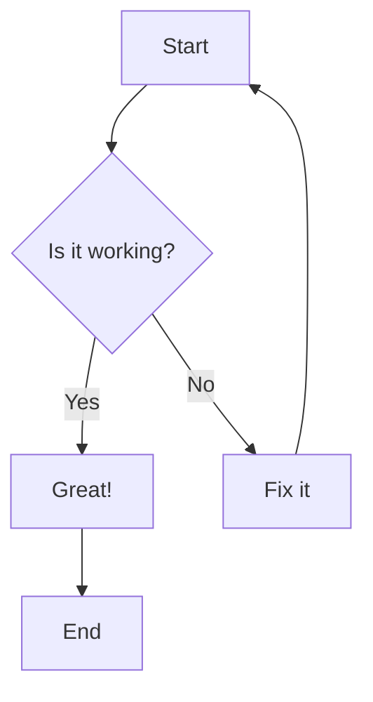

# MDX Content Creation Guide

This guide will teach you how to create and edit MDX files for your courses and presentations.

## File Structure

Your content is organized as follows:

```
courses/
├── course-name/
│   ├── _course.mdx                 # Course definition file
│   ├── lesson-1.mdx               # Individual lecture
│   ├── lesson-2.mdx               # Another lecture
│   └── lesson-1.assignment.mdx    # Optional assignment
```

## Quick Start

### Step 1: Create a New Course

Create a new directory and course definition:

```bash
mkdir courses/my-new-course
```

Create `_course.mdx`:

```mdx
---
title: 'My Amazing Course'
description: 'Learn incredible things in this course'
visible: true
---

# My Amazing Course

This course will teach you everything you need to know.

## What You'll Learn

- Topic 1
- Topic 2
- Topic 3
```

### Step 2: Create Your First Lesson

Create `lesson-1.mdx`:

```mdx
---
title: 'Lesson 1 - Getting Started'
description: 'Introduction to the basics'
tags: ['introduction', 'basics']
visible: true
---

# Getting Started

## Learning Objectives

By the end of this lesson, you will:

- Understand the fundamentals
- Know how to apply concepts
- Be ready for the next lesson

## What is This About?

Your lesson content goes here...

## Summary

Today we covered the basics of...
```

## Frontmatter Configuration

Every MDX file must start with YAML frontmatter:

```yaml
---
title: 'Your Lesson Title' # Required
description: 'Brief description' # Optional
tags: ['tag1', 'tag2', 'tag3'] # Optional
visible: true # Optional (default: true)
---
```

## Content Formatting

### Headers

```markdown
# Main Title (H1) - Large title, accent color, centered

## Section Title (H2) - Creates new slides, CENTERED

### Subsection (H3) - Also creates new slides, LEFT-ALIGNED

#### Sub-subsection (H4) - Left-aligned, smaller
```

### Text Formatting

```markdown
**Bold text** - Makes text bold
_Italic text_ - Makes text italic
`Inline code` - Highlights code snippets
[Link text](https://example.com) - Creates links
```

### Lists

```markdown
Bullet lists (left-aligned):

- First item
- Second item
  - Nested item
- Third item

Numbered lists (left-aligned):

1. First step
2. Second step
3. Third step
```

### Blockquotes

```markdown
> This creates a highlighted quote box with accent border (left-aligned)
```

## Working with Images

### Image Storage

**Always place images in:** `public/images/[course-name]/`

### Basic Image Usage (Auto-Centered)

```markdown

```

**Note**: Images are automatically centered in slide presentation mode.

### Image Sizing and Alignment

#### Small Centered Images (300px)

```html
<div style="text-align: center;">
  
</div>
```

#### Large Images (800px max)

```html
<div style="text-align: center;">
  
</div>
```

#### Left-Aligned Images (Override Default Centering)

```html
<div style="text-align: left;">
  
  <p>This text will wrap around the image...</p>
</div>
<div style="clear: both;"></div>
```

#### Right-Aligned Images

```html
<div style="text-align: right;">
  
</div>
```

### Image Sizing Guidelines

- **Icons/Small diagrams**: 150-300px width
- **Medium illustrations**: 400-600px width
- **Large screenshots**: 600-800px width
- **Full-width banners**: 100% width

## Content Alignment (UPDATED BEHAVIOR)

### Default Content Alignment

- **H1 (# headers)**: **Centered**
- **H2 (## headers)**: **Centered**
- **H3 and below (### ####)**: **Left-aligned**
- **Text content** (paragraphs, lists, blockquotes): **Left-aligned**
- **Images**: **Centered** automatically
- **Code blocks**: **Centered** automatically
- **Mermaid diagrams**: **Centered** automatically
- **Tables**: **Centered** automatically

### Manual Alignment Override

#### Center Align Text Content

```html
<div style="text-align: center;">
  <p>This paragraph will be centered instead of left-aligned.</p>
</div>
```

#### Right Align Content

```html
<div style="text-align: right;">
  <p>This content is right-aligned.</p>
</div>
```

#### Justified Text

```html
<div style="text-align: justify;">
  <p>This long paragraph will be justified across the full width.</p>
</div>
```

## Tables (Auto-Centered)

```markdown
| Header 1     | Header 2     | Header 3     |
| ------------ | ------------ | ------------ |
| Row 1, Col 1 | Row 1, Col 2 | Row 1, Col 3 |
| Row 2, Col 1 | Row 2, Col 2 | Row 2, Col 3 |
```

**Note**: Tables are automatically centered in slide presentation mode.

## Code Blocks (Auto-Centered)

### Inline Code

```markdown
Use `const variable = value` for declaring variables.
```

### Code Blocks with Syntax Highlighting (Auto-Centered)

````markdown
```javascript
function greetUser(name) {
  console.log(`Hello, ${name}!`);
  return `Welcome, ${name}`;
}
```

```python
def greet_user(name):
    print(f"Hello, {name}!")
    return f"Welcome, {name}"
```

```sql
SELECT name, email, created_at
FROM users
WHERE active = 1
ORDER BY created_at DESC;
```
````

### Code Blocks with Filenames

````markdown
```javascript filename="app.js"
const express = require('express');
const app = express();
app.listen(3000);
```
````

**Note**: All code blocks are automatically centered in slide presentation mode.

## Mermaid Diagrams (Auto-Centered)

Create interactive diagrams (automatically centered):

````markdown

````

**Note**: Mermaid diagrams are automatically centered in slide presentation mode.

## Creating Slides (UPDATED)

Your content automatically becomes slides in presentation mode.

### How Slides Work (NEW)

- **Both `## Header` AND `### Header` create new slides**
- Content between headers becomes slide content
- Access slides at `/slides/course/lecture`

### Slide Structure Example

````markdown
---
title: 'Introduction to Programming'
---

# Introduction to Programming

## What is Programming?

Programming is creating instructions for computers.

- Code: Written instructions (left-aligned)
- Compiler: Translates code (left-aligned)
- Execution: Computer follows instructions (left-aligned)

## Your First Program

```python
print("Hello, World!")
```
````

### Code Explanation

The print function displays text on the screen.

## Key Concepts

- Variables: Store data (left-aligned)
- Functions: Reusable code (left-aligned)
- Conditions: Make decisions (left-aligned)
- Loops: Repeat actions (left-aligned)

`````

### Slide Design Benefits

With the new alignment:
- **H2 headers stand out**: Centered major topic headers draw attention
- **H3 headers flow naturally**: Left-aligned sub-topics are easy to read
- **Text content is readable**: Left-aligned content follows natural reading flow
- **Visual elements pop**: Images, diagrams, code centered for emphasis
- **More granular slides**: Use both ## and ### for better organization

## Advanced Styling

### Custom Info Boxes (Left-Aligned)

```html
<!-- Info/Tip Box -->
<div style="background: #1a1a2e; border-left: 4px solid #4CAF50; padding: 20px; margin: 20px 0; border-radius: 5px;">
  <strong>💡 Tip:</strong> This is helpful information!
</div>

<!-- Warning Box -->
<div style="background: #2a1810; border-left: 4px solid #ff9800; padding: 20px; margin: 20px 0; border-radius: 5px;">
  <strong>⚠️ Warning:</strong> Be careful with this!
</div>

<!-- Success Box -->
<div style="background: #0a2a0a; border-left: 4px solid #4CAF50; padding: 20px; margin: 20px 0; border-radius: 5px;">
  <strong>✅ Success:</strong> Great job!
</div>
```

### Two-Column Layouts

```html
<div style="display: flex; gap: 20px; align-items: center;">
  <div style="flex: 1;">
    <h4>Left Column</h4>
    <p>Content for the left side goes here.</p>
    <ul>
      <li>Point 1</li>
      <li>Point 2</li>
    </ul>
  </div>
  <div style="flex: 1; text-align: center;">
    
  </div>
</div>
```

### Spacing Control

```html
<!-- Add vertical spacing -->
<div style="margin: 40px 0;"></div>

<!-- Custom padding around content -->
<div style="padding: 30px; background: #1a1a1a; border-radius: 10px;">
  <p>Content with custom padding and background.</p>
</div>
```

## Creating Assignments

Create assignment files with `.assignment.mdx`:

**File:** `courses/my-course/lesson-1.assignment.mdx`

````markdown
---
title: 'Lesson 1 Assignment - Practice Exercises'
description: 'Apply what you learned in the first lesson'
visible: true
---

# Assignment: Getting Started Practice

## Overview

This assignment will help you practice the concepts from Lesson 1.

## Instructions

1. Complete all tasks below
2. Submit your work through the course platform
3. Ask questions if you get stuck

## Tasks

### Task 1: Basic Setup (25 points)

Set up your development environment:

- [ ] Install required software
- [ ] Create your first project
- [ ] Verify everything works

### Task 2: First Program (50 points)

Create a simple program that:

```python
print("Hello, World!")
print("My name is [Your Name]")
```
```

## Submission

Upload your files to the course platform.

`````

## Best Practices

### File Naming

- Use **kebab-case**: `my-lesson-name.mdx`
- Be **descriptive**: `database-fundamentals.mdx`
- Use **numbers** for ordering: `01-introduction.mdx`

### Content Organization

- **Start with objectives**: What will students learn?
- **Use both ## and ### headers**: Create logical slide breaks
- **Include examples**: Show, don't just tell
- **End with summary**: Reinforce key points

### Slide Organization (UPDATED)

- **Use ## for major topics**: Main concepts, sections (CENTERED headers)
- **Use ### for sub-topics**: Detailed explanations, examples (LEFT-ALIGNED headers)
- **Keep slides focused**: One concept per slide
- **Leverage mixed alignment**: Centered major topics, left-aligned details

### Image Best Practices

- **Optimize file sizes**: Compress images before adding
- **Use descriptive names**: `database-schema-example.png`
- **Include alt text**: Always describe the image
- **Images auto-center**: No need for manual centering in slides

### Slide Design

- **Major topics stand out**: Centered ## headers draw attention
- **Details flow naturally**: Left-aligned ### headers and content are easy to read
- **Visual elements pop**: Centered images/code/diagrams draw attention
- **Create more slides**: Use both ## and ### for better pacing
- **Consistent formatting**: Use same styles throughout

## Quick Reference

### Viewing Your Content

- **Regular view**: `/courses/[course]/[lecture]`
- **Slide presentation**: `/slides/[course]/[lecture]`
- **Assignment view**: `/assignments/[course]/[lecture]`

### File Operations

```bash
# Create new course directory
mkdir courses/new-course-name

# Copy existing lecture as template
cp courses/database-design/session-1-fundamentals.mdx courses/new-course/lesson-1.mdx

# Add images to course
mkdir public/images/new-course-name
cp my-image.png public/images/new-course-name/
```

## Complete Example (Updated)

Here's a complete example showing the new slide behavior and alignment:

````mdx
---
title: 'HTML Basics - Building Web Pages'
description: 'Learn the fundamentals of HTML and create your first web page'
tags: ['html', 'web-development', 'beginner']
visible: true
---

# HTML Basics - Building Web Pages

## Learning Objectives

By the end of this lesson, you will be able to:

- Understand what HTML is and why it's important
- Create a basic HTML document structure
- Use common HTML elements
- Build your first complete web page

## What is HTML?

HTML (HyperText Markup Language) is the standard language for creating web pages.

Think of HTML as the skeleton of a web page:

- Structure: Organizes content
- Meaning: Defines what content represents
- Links: Connects pages together


### HTML Elements

HTML uses elements to structure content:

- Tags define elements: `<tagname>content</tagname>`
- Attributes provide additional information
- Elements can be nested inside other elements

## HTML Document Structure

Every HTML document follows this basic structure:

```html filename="index.html"
<!DOCTYPE html>
<html lang="en">
  <head>
    <meta charset="UTF-8" />
    <title>My First Web Page</title>
  </head>
  <body>
    <h1>Welcome to My Website!</h1>
    <p>This is my first paragraph.</p>
  </body>
</html>
```

### Document Parts

The HTML document has several key parts:

- DOCTYPE declaration tells the browser this is HTML5
- html element contains all page content
- head element contains metadata
- body element contains visible content

## Common HTML Elements

Let's explore the most important HTML elements you'll use.

### Headings

```html
<h1>Main Heading</h1>
<h2>Section Heading</h2>
<h3>Subsection Heading</h3>
```

### Paragraphs and Text

```html
<p>This is a paragraph of text.</p>
<p>This has <strong>bold</strong> and <em>italic</em> text.</p>
```

## Practice Exercise

Create a simple webpage with the elements we've learned:

1. Start with the basic HTML structure
2. Add a main heading with your name
3. Include a paragraph about yourself
4. Add a list of your hobbies

Try building this now before moving to the next slide!

### Solution Example

Here's what your practice page might look like:

```html filename="about-me.html"
<!DOCTYPE html>
<html lang="en">
  <head>
    <title>About Me</title>
  </head>
  <body>
    <h1>About John Doe</h1>
    <p>I'm a student learning web development.</p>
    <h2>My Hobbies</h2>
    <ul>
      <li>Programming</li>
      <li>Reading</li>
      <li>Gaming</li>
    </ul>
  </body>
</html>
```

## Summary

Today we covered HTML fundamentals:

- HTML provides structure to web pages
- Documents have a standard structure with head and body
- Elements use tags to define content
- Common elements include headings, paragraphs, and lists

You're now ready to create basic web pages with HTML!

### Next Steps

In the next lesson, we'll learn:

- More HTML elements (links, images, forms)
- How to add CSS for styling
- Best practices for writing clean HTML

```

## Key Changes Summary

✅ **New Slide Behavior**: Both `##` and `###` headers create new slides
✅ **H2 Headers Centered**: `##` headers are centered for emphasis
✅ **H3+ Headers Left-Aligned**: `###` and below are left-aligned for readability
✅ **Text Content Left-Aligned**: Paragraphs, lists, blockquotes follow natural reading flow
✅ **Visual Assets Centered**: Images, code blocks, mermaid diagrams, tables auto-center

This provides the perfect balance: prominent centered major topics with readable left-aligned details and centered visual elements!
```
````
