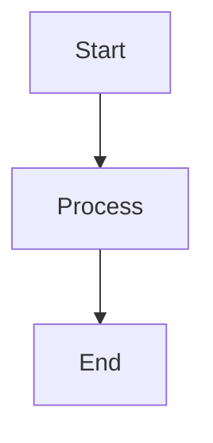
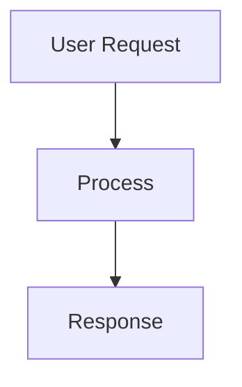

# Technical Teaching Platform

A minimalist, Next.js 14-based platform for technical education powered by Markdown lectures, interactive presentations, and hands-on assignments.

## Features

✨ **Core Features**

- 📚 Automatic course discovery from `/courses/[course]/[lecture].mdx` structure
- 📄 Article view with clean, readable formatting
- 🎤 Presentation mode for full-screen teaching
- 📝 Assignment system with automatic detection
- 🔗 Smart anchor links for all headings
- 📱 Fully responsive design

🎨 **Rich Content Support**

- 💻 Syntax-highlighted code blocks with copy buttons
- 📊 Mermaid diagrams with zoom functionality
- 🖼️ Zoomable images and diagrams
- 📋 Tables, blockquotes, and lists
- 🎯 Excalidraw PNG support

🎨 **Design**

- 🌑 Flexoki Dark theme with minimalist design
- 📝 Inter font for UI, JetBrains Mono for code
- 🚫 No borders, logos, or navbars - pure content focus
- ⚡ Smooth animations and transitions

## Quick Start

### 1. Install Dependencies

```bash
npm install
```

### 2. Create Your First Course

Create the course directory structure:

```
courses/
├── javascript-basics/
│   ├── 01-variables.mdx
│   ├── 01-variables.assignment.mdx
│   └── 02-functions.mdx
└── react-fundamentals/
    ├── 01-components.mdx
    └── 02-state.mdx
```

### 3. Start Development Server

```bash
npm run dev
```

Open [http://localhost:3000](http://localhost:3000) to view the platform.

## Course Structure

### File Organization

```
courses/
└── [course-name]/
    ├── [lecture-slug].mdx          # Main lecture content
    └── [lecture-slug].assignment.mdx # Optional assignment (auto-detected)
```

### Lecture File Format

Each lecture file should include frontmatter and content:

````mdx
---
title: 'JavaScript Variables and Data Types'
description: 'Learn about declaring variables and understanding data types'
---

# JavaScript Variables and Data Types

Your lecture content goes here...

## Code Examples

```javascript
let message = 'Hello, World!';
const PI = 3.14159;
```
````

## Mermaid Diagrams



````

### Assignment Files

Assignment files follow the same format but are automatically linked from their corresponding lecture:

```mdx
---
title: "Variables and Data Types - Assignment"
description: "Practice exercises for variable declarations"
---

# Assignment: Variables and Data Types

Complete the following exercises...
````

## Content Features

### Code Blocks

All code blocks include syntax highlighting and copy buttons:

````markdown
```javascript
function greet(name) {
  return `Hello, ${name}!`;
}
```
````

### Mermaid Diagrams

Create interactive diagrams with zoom support:

````markdown

````

### Images and Media

Images are automatically zoomable:

```markdown

```

### Smart Anchors

All headings automatically get anchor links:

```markdown
## This Heading

### Gets an Anchor → #this-heading
```

## Platform Navigation

### Homepage

- Lists all available courses as expandable dropdowns
- Shows lecture count for each course
- Direct links to lectures and assignments

### Lecture View

- Clean article layout with typography optimized for reading
- "🎤 View as Presentation" button for full-screen mode
- Automatic assignment detection and linking
- Breadcrumb navigation

### Presentation Mode

- Full-screen layout optimized for teaching
- Larger text and centered content
- All interactive features maintained
- Easy exit back to article view

### Assignment View

- Dedicated layout for exercises and homework
- Links back to the source lecture
- Same rich content features as lectures

## Customization

### Styling

The platform uses Tailwind CSS with a custom Flexoki Dark theme. Colors are defined in `tailwind.config.js`:

```javascript
colors: {
  background: '#100F0F',  // Main background
  text: '#CECDC3',        // Primary text
  muted: '#878580',       // Secondary text
  accent: '#D0A215',      // Accent color
  secondary: '#4385BE',   // Secondary accent
  surface: '#1C1B1A',     // Card backgrounds
  border: '#403E3C',      // Borders
}
```

### Content Processing

Content is processed using:

- **gray-matter** for frontmatter parsing
- **next-mdx-remote** for MDX compilation
- **react-syntax-highlighter** for code highlighting
- **mermaid** for diagram rendering
- **medium-zoom** for image zoom functionality

## Development

### Project Structure

```
├── app/                          # Next.js 14 App Router
│   ├── globals.css              # Global styles and Tailwind
│   ├── layout.tsx               # Root layout
│   ├── page.tsx                 # Homepage
│   └── courses/[course]/[lecture]/
│       ├── page.tsx             # Lecture view
│       ├── assignment/page.tsx   # Assignment view
│       └── presentation/page.tsx # Presentation mode
├── components/                   # React components
│   ├── MDXComponents.tsx        # Custom MDX components
│   ├── MDXRenderer.tsx          # MDX content renderer
│   ├── MermaidDiagram.tsx       # Mermaid diagram component
│   ├── PresentationRenderer.tsx # Presentation mode renderer
│   └── CourseDropdown.tsx       # Course listing component
├── lib/
│   └── content.ts               # Content loading utilities
├── courses/                     # Your course content
└── public/                      # Static assets
```

### Adding New Features

To add new MDX components, edit `components/MDXComponents.tsx`:

```tsx
export const mdxComponents = {
  // Add your custom components here
  CustomComponent: ({ children }) => (
    <div className="custom-style">{children}</div>
  ),
  // ... existing components
};
```

## Deployment

### Build for Production

```bash
npm run build
npm start
```

### Static Export (Optional)

For static hosting, configure `next.config.js`:

```javascript
/** @type {import('next').NextConfig} */
const nextConfig = {
  output: 'export',
  trailingSlash: true,
  images: {
    unoptimized: true,
  },
};
```

Then build:

```bash
npm run build
```

## Best Practices

### Content Organization

- Use clear, descriptive course and lecture names
- Keep lectures focused on single topics
- Include practical examples and exercises
- Use consistent naming conventions

### Writing Guidelines

- Write in clear, accessible language
- Include code examples for technical concepts
- Use diagrams to illustrate complex ideas
- Provide hands-on exercises

### Performance

- Optimize images before adding them
- Keep individual lecture files reasonably sized
- Use lazy loading for heavy content

## Examples

The platform comes with example courses:

- **JavaScript Basics**: Variables, functions, and core concepts
- **React Fundamentals**: Components, props, and modern React patterns

These serve as templates for creating your own content.

## Contributing

1. Fork the repository
2. Create your feature branch
3. Add your improvements
4. Test thoroughly
5. Submit a pull request

## License

MIT License - feel free to use this for your own educational projects!

---

**Happy Teaching! 🎓**
