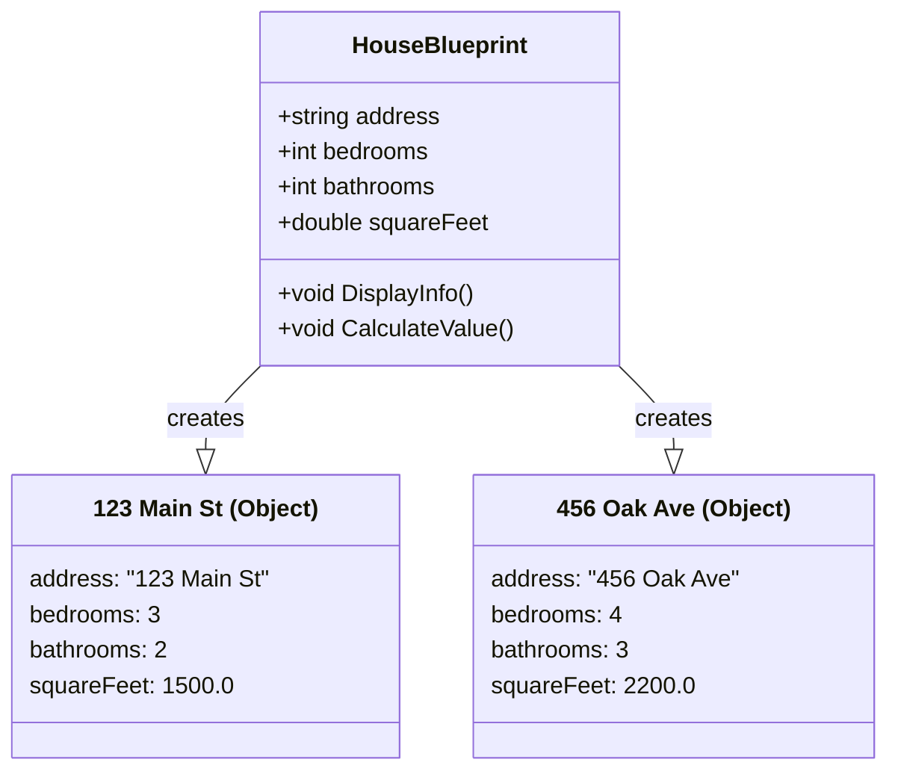
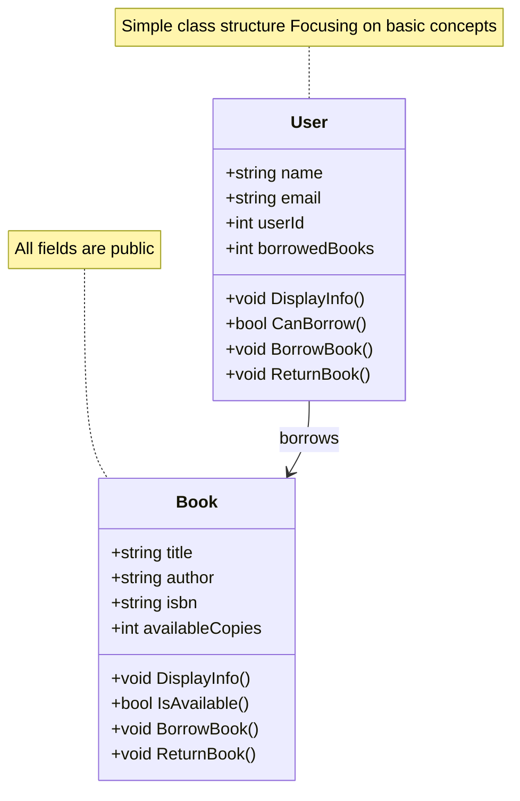
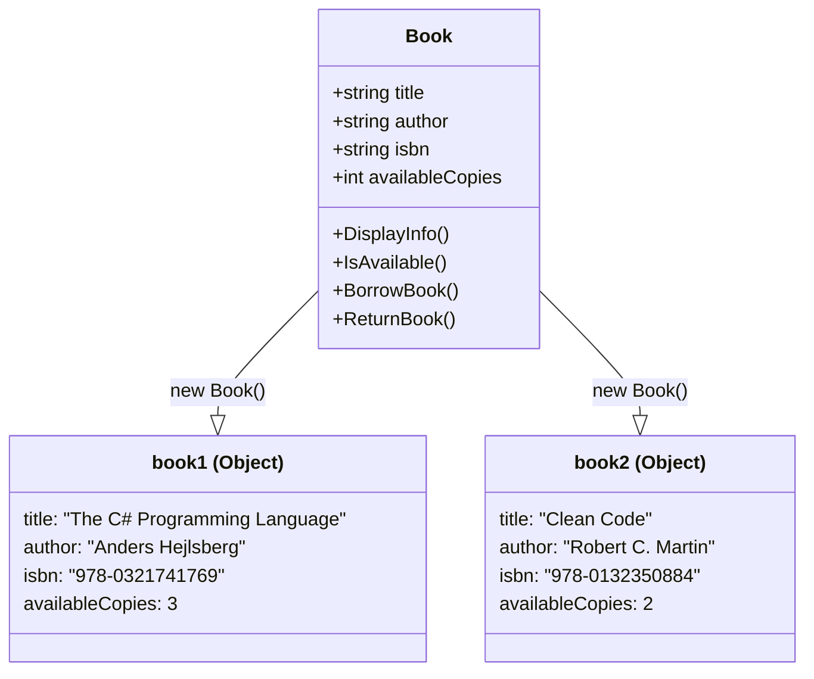
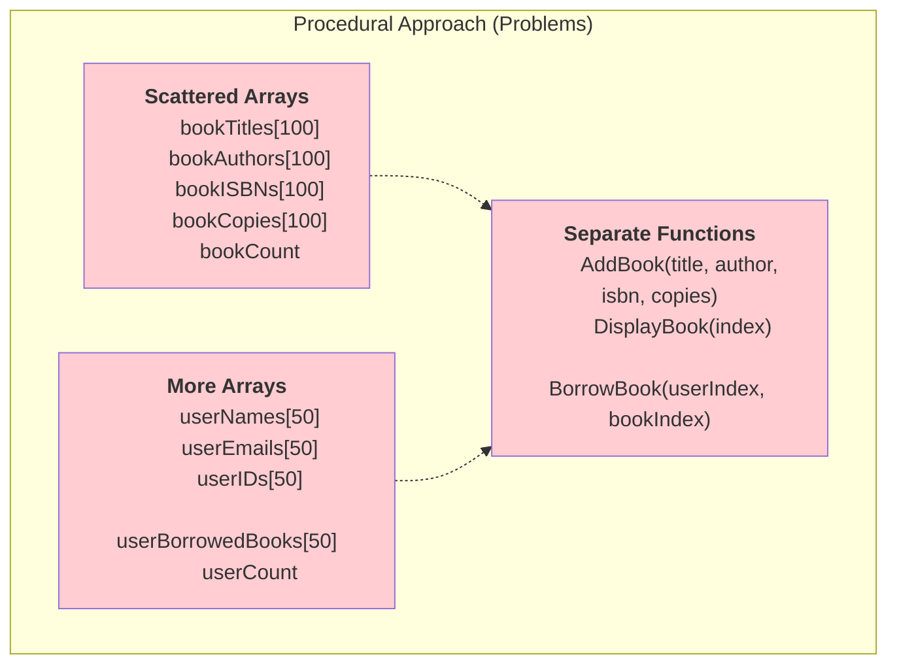
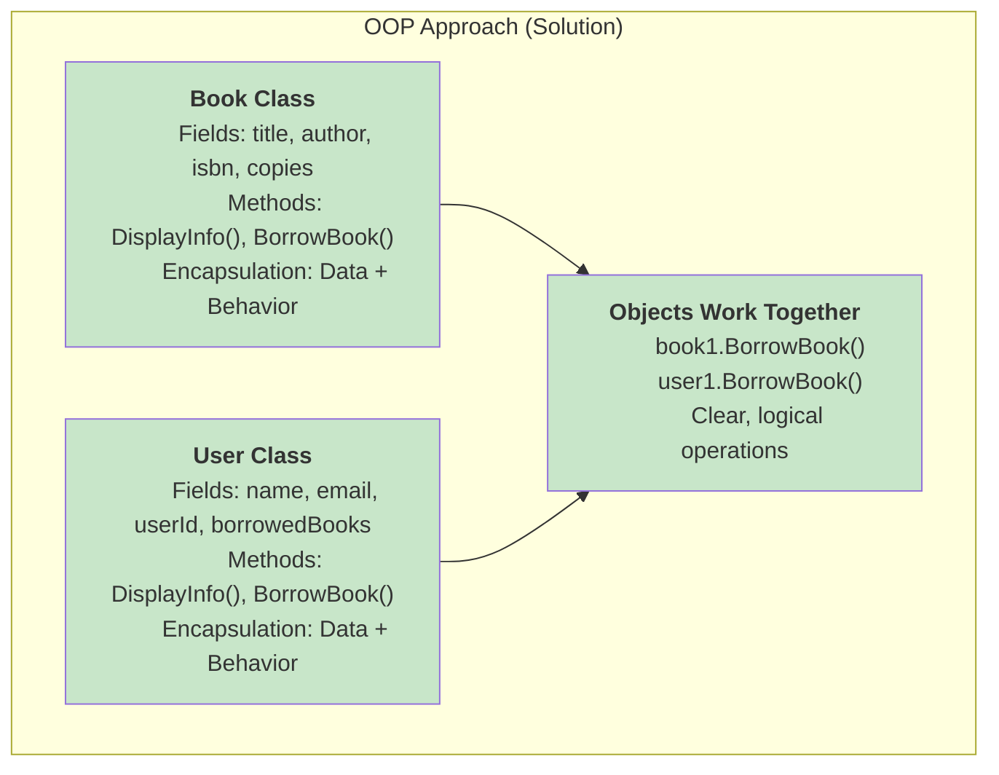

## Classes, Objects, and Basic Encapsulation

---

## User Stories For Library System

Before we start coding, let's understand what our Library Management System should accomplish from the user's perspective.

### Core User Stories

**As a library user, I want to:**

1. **View Books** - See available books with their details (title, author, copies available)
2. **Borrow Books** - Take out books that are available
3. **Return Books** - Give back borrowed books
4. **Check Status** - See how many books I currently have borrowed

**As a librarian, I want to:**

5. **Add Books** - Register new books in the system
6. **Track Availability** - See which books are available or borrowed

### How This Guides Our Code

These stories help us understand **why** we need:

- **Book Class** - To store book information and handle borrowing/returning (Stories 1, 2, 3)
- **User Class** - To track who borrowed what and enforce limits (Stories 3, 4)
- **Methods** - To perform actions like `BorrowBook()`, `ReturnBook()`, `DisplayInfo()` (All stories)

> **Remember:** When coding, ask yourself "Which user story does this feature support?"

---

## The Problem: Why Do We Need OOP?

### Procedural Programming Limitations

Imagine you're writing a program to manage books using only what you know:

```csharp

// Procedural approach

string[] bookTitles = new string[100];    //Book data scattered

string[] bookAuthors = new string[100];   //across multiple arrays

string[] bookISBNs = new string[100];     //Hard to keep in sync!

int[] bookCopies = new int[100];          //Easy to make mistakes

int bookCount = 0;


string[] userNames = new string[50];  //Same problem with users

string[] userEmails = new string[50];  //Data and behavior separated

int[] userIDs = new int[50];

int userCount = 0;


void AddBook(string title, string author, string isbn, int copies)

{

    // PROBLEM: No validation! What if title is null? ISBN invalid? Copies negative?

    bookTitles[bookCount] = title; // Could accept garbage data!

    bookAuthors[bookCount] = author;  // No protection against errors

    bookISBNs[bookCount] = isbn; // Easy to corrupt data

    bookCopies[bookCount] = copies;  // Business rules not enforced

    bookCount++;

}


void DisplayBook(int index)

{

    // PROBLEM: Easy to use wrong index, arrays can get out of sync

    Console.WriteLine($"Title: {bookTitles[index]}");  
    Console.WriteLine($"Author: {bookAuthors[index]}");  
    Console.WriteLine($"ISBN: {bookISBNs[index]}");
    Console.WriteLine($"Copies: {bookCopies[index]}");  

}

```

**Problems with this approach:**

1. **Data and behavior are separated** - book data is in arrays, book operations are in separate functions
2. **Hard to maintain** - adding a new book property requires changing multiple arrays
3. **Error-prone** - easy to get array indices wrong
4. **Not scalable** - what if we want different types of users?
5. **No real-world modeling** - doesn't reflect how we think about books and users

> **Matt Weisfeld (The Object-Oriented Thought Process):** _"OOP is about managing complexity by modeling real-world entities."_

Think about a real library:

- A **Book** has properties (title, author, ISBN) and behaviors (can be borrowed, returned)
- A **User** has properties (name, ID) and behaviors (can borrow books, return books)
- These entities **interact** with each other in meaningful ways

OOP lets us model software the same way we think about the real world!

---

## Introduction to Object-Oriented Programming

### What is OOP?

Object-Oriented Programming is a programming paradigm that organizes code around **objects** rather than functions and procedures.

> **Jon Skeet (C# in Depth):** _"Types exist to give shape and behavior to the data in your application."_

### The Four Pillars of OOP

1. **Encapsulation** - Bundling data and methods together
2. **Inheritance** - Creating new classes based on existing ones
3. **Polymorphism** - Same interface, different implementations
4. **Abstraction** - Hiding complex implementation details

\*Today we'll focus on the first pillar: **Encapsulation\***

---

## Classes vs Objects

**Class**: A blueprint or template for creating objects
**Object**: A specific instance created from a class

### Real-World Analogy: House Blueprint vs Actual Houses



- **HouseBlueprint** = Class (the design/template)
- **123 Main St House** = Object (actual house built from blueprint)
- **456 Oak Ave House** = Another Object (different house, same blueprint)

---

## Your First Class: The Book Class

### UML Class Diagram



Let's create our first class for the Library Management System:

```csharp

public class Book

{

    // Fields (data) - what a book HAS
    public string title;
    public string author;
    public string isbn;
    public int availableCopies;

    // Methods (behavior) - what a book can DO
    public void DisplayInfo()

    {
        Console.WriteLine($"Title: {title}");
        Console.WriteLine($"Author: {author}");
        Console.WriteLine($"ISBN: {isbn}");
        Console.WriteLine($"Available Copies: {availableCopies}");
        Console.WriteLine("------------------------");

    }

    public bool IsAvailable()
    {
        return availableCopies > 0;
    }

    public void BorrowBook()
    {
        if (availableCopies > 0)
        {
            availableCopies--;
            Console.WriteLine($"Book '{title}' borrowed successfully!");
        }
        else
        {
            Console.WriteLine($"Sorry, '{title}' is not available.");
        }

    }

    public void ReturnBook()
    {
       availableCopies++;
        Console.WriteLine($"Book '{title}' returned successfully!");

    }

}

```

### Key Concepts Explained

1. **Fields**: Store the data (title, author, isbn, availableCopies)
2. **Methods**: Define behaviors (DisplayInfo, BorrowBook, ReturnBook)
3. **Encapsulation**: Data and related behaviors are bundled together in one class

---

## Creating the User Class

```csharp

// User.cs

using System;


public class User

{

    // Fields - what a user HAS

    public string name;

    public string email;

    public int userId;

    public int borrowedBooks;

    // Methods - what a user can DO

    public void DisplayInfo()

    {

        Console.WriteLine($"Name: {name}");

        Console.WriteLine($"Email: {email}");

        Console.WriteLine($"User ID: {userId}");

        Console.WriteLine($"Books Borrowed: {borrowedBooks}");

        Console.WriteLine("------------------------");

    }

    public bool CanBorrow()

    {

        return borrowedBooks < 3; // Library rule: max 3 books

    }

    public void BorrowBook()

    {

        if (CanBorrow())

        {

            borrowedBooks++;

            Console.WriteLine($"{name} successfully borrowed a book!");

        }

        else

        {

            Console.WriteLine($"{name} has reached the borrowing limit.");

        }

    }

    public void ReturnBook()

    {

        if (borrowedBooks > 0)

        {

            borrowedBooks--;

            Console.WriteLine($"{name} successfully returned a book!");

        }

    }

}

```

---

### Understanding Object Creation



**Key Points:**

- `Book` is the **class** (blueprint)

- `book1` and `book2` are **objects** (instances)

- Each object has its own copy of the fields

- All objects share the same methods defined in the class

### Procedural vs OOP Data Structure Comparison





---

## Introduction to Access Modifiers

### Why Access Control Matters

Right now, anyone can directly modify our book and user data:

```csharp

Book book = new Book();

book.availableCopies = -5; // This shouldn't be allowed!

book.isbn = ""; // Invalid ISBN

```

This breaks the integrity of our objects. We need **access control**.

### Basic Access Modifiers

```csharp

public class Book

{

    // Public: accessible from anywhere
    public string title;

    // Private: only accessible within this class
    private string isbn;

    // Public method to safely access private field
    public string GetISBN()

    {

        return isbn;

    }

    // Public method to safely set private field
    public void SetISBN(string newISBN)

    {

        if (newISBN.Length >= 10)

        {

            isbn = newISBN;

        }

        else

        {

            Console.WriteLine("Invalid ISBN format!");

        }

    }

}

```

> **Matt Weisfeld:** _"Encapsulation provides a way to protect data from unauthorized access and modification."_
