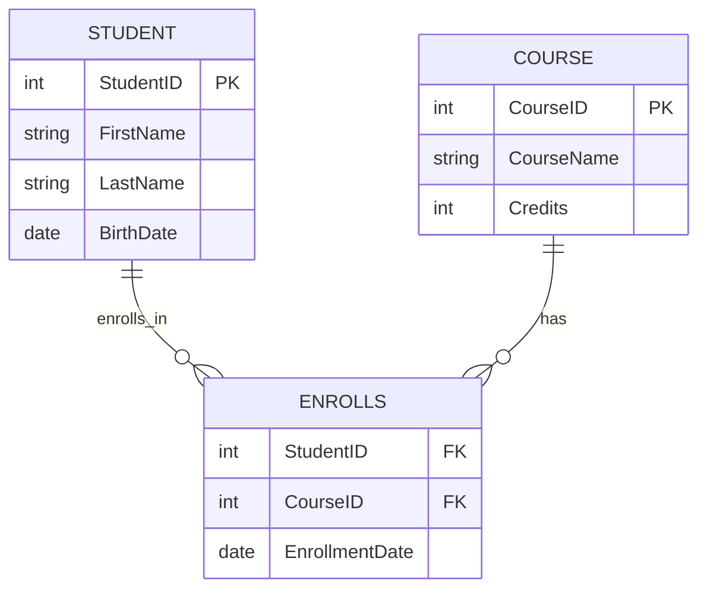
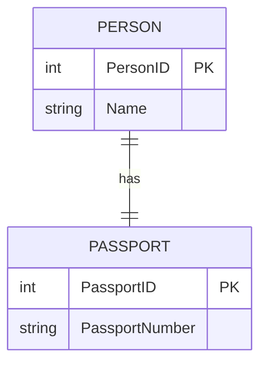
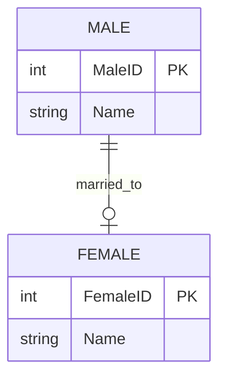
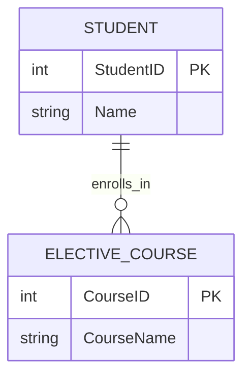
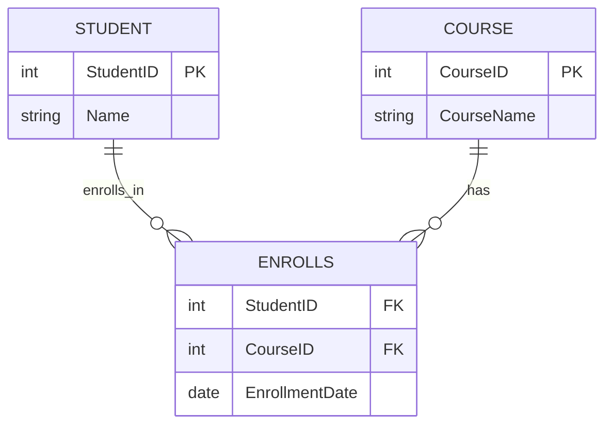
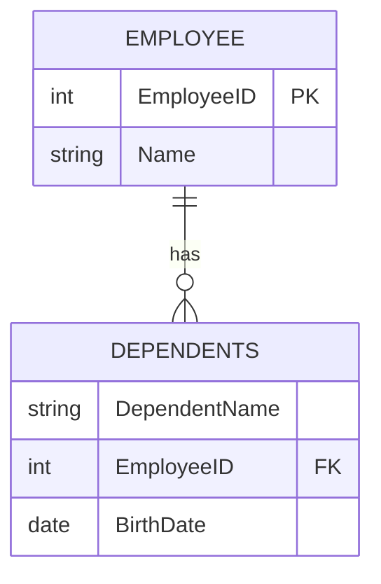

# Database Design

## 1. Entity-Relationship Modeling (ER Modeling)

### 1.1 What is ER Modeling?

Entity-Relationship (ER) modeling is a conceptual technique used to design databases by representing real-world objects (entities), their properties (attributes), and the connections between them (relationships). It provides a high-level view of the database structure, making it easier to plan and communicate design ideas before implementation in a relational database management system (RDBMS) like MySQL or Oracle.

**Real-World Analogy:** Think of ER modeling as creating a map of a university campus. Buildings (entities) like "Student" or "Course" have features (attributes) like names or IDs, and paths (relationships) show how they connect, such as students enrolling in courses.

> 💡 **Tip for Beginners:** ER modeling is like sketching a plan before building—it helps you avoid mistakes by organizing data logically from the start.

### 1.2 Importance and Benefits

ER modeling is crucial for effective database design because it:

- **Systematically Analyzes Requirements:** Ensures all necessary data is captured
- **Simplifies Communication:** Provides a visual representation that stakeholders can understand
- **Facilitates Implementation:** Acts as a bridge between conceptual design and the physical database, reducing errors during development

### 1.3 Basic Components

#### 1.3.1 Entities (Strong, Weak)

- **Entity:** A real-world object or concept that can be uniquely identified and stored in a database (e.g., a student, course, or department).
  - **Strong Entity:** Has a unique identifier, called a primary key (e.g., a Student with a unique StudentID).
  - **Weak Entity:** Depends on another entity for identification and lacks its own unique key (e.g., a Dependent of an Employee, identified by the Employee's ID and a partial key like DependentName).

**Example:** In a university database, "Student" is a strong entity with a unique StudentID, while "Dependent" (e.g., a student's family member) is a weak entity tied to the Student.

#### 1.3.2 Attributes (Simple, Composite, Derived, Multivalued)

- **Attribute:** A property describing an entity or relationship.
  - **Simple Attribute:** Cannot be divided (e.g., StudentID or Age).
  - **Composite Attribute:** Composed of multiple attributes (e.g., Address with Street, City, Zip).
  - **Derived Attribute:** Calculated from other attributes (e.g., Age derived from BirthDate).
  - **Multivalued Attribute:** Can have multiple values (e.g., PhoneNumbers for a student).

**Example:** A Student entity might have attributes like StudentID (simple), Name (composite: FirstName, LastName), Age (derived from BirthDate), and PhoneNumbers (multivalued).

> 💡 **Tip for Beginners:** Think of attributes as details about an object, like describing a person with their ID, name, and contact information.

#### 1.3.3 Relationships (1:1, 1:N, M:N)

- **Relationship:** Describes how entities are associated.
  - **One-to-One (1:1):** One instance of an entity relates to at most one instance of another (e.g., one Student has one Passport).
  - **One-to-Many (1:N):** One instance of an entity relates to multiple instances of another (e.g., one Department has many Students).
  - **Many-to-Many (M:N):** Multiple instances of one entity relate to multiple instances of another (e.g., Students enroll in multiple Courses, and Courses have multiple Students).

**Example:** The relationship "Enrolls" connects Students and Courses (M:N), meaning a student can take multiple courses, and a course can have multiple students.

### 1.4 Types of Relationships and Examples

- **Generalization-Specialization:** Represents hierarchical relationships, like Employee (super) and Manager (subtype).
- **Examples:**
  - **Marriage:** Connects Person entities (1:1, roles: husband, wife).
  - **Owns:** Links Company to Computer (1:N).
  - **Supervises:** Connects Employee to Department (1:N).
  - **Performs:** Links Artist to Song (M:N).
  - **Proves:** Connects Mathematician to Conjecture (1:1).

**Mermaid Diagram: Student-Course Relationship**



### 1.5 Notations Used in ER Diagrams

- **Chen's Notation:** Uses rectangles for entities, diamonds for relationships, and ovals for attributes. Lines indicate connections, with cardinality shown via symbols like double lines (total participation) or arrows (key constraints).
- **Crow's Foot Notation:** Uses boxes for entities, lines for relationships, and symbols like rings (zero), dashes (one), or crow's feet (many) to show cardinality.

**Example:** In Crow's Foot, a Student (box) connected to Enrolls (line) with a crow's foot indicates many students can enroll in a course.

> 💡 **Tip for Beginners:** Crow's Foot is popular because its symbols are intuitive—think of a crow's foot as "many" toes spreading out.

### 1.6 Cardinality and Participation

- **Cardinality:** Specifies how many instances of one entity can relate to another.
  - **1:1:** One-to-one (e.g., one Student, one Passport).
  - **1:N:** One-to-many (e.g., one Department, many Students).
  - **M:N:** Many-to-many (e.g., Students and Courses).
- **Participation:** Indicates whether an entity must participate in a relationship.
  - **Total Participation:** Every entity instance must be involved (shown as a double line in Chen's notation).
  - **Partial Participation:** Participation is optional (single line).

**Example:** In a university, every Student must belong to a Department (total participation), but not every Department needs Students (partial participation).

## 2. Keys in Database Design

Keys are attributes or sets of attributes that uniquely identify records in a table or establish relationships between tables, ensuring data integrity and efficient retrieval.

### 2.1 Primary Key

A primary key is a chosen candidate key that uniquely identifies each record in a table. It cannot contain NULL values and ensures no duplicates.

**Example:** In a Student table, `StudentID` is the primary key.

```sql
CREATE TABLE Students (
    StudentID INT PRIMARY KEY,
    FirstName VARCHAR(50),
    LastName VARCHAR(50)
);
```

### 2.2 Composite Key

A composite key uses two or more attributes to uniquely identify records when no single attribute is sufficient.

**Example:** In an Enrollments table, `{StudentID, CourseID}` forms a composite key.

> 💡 **Tip for Beginners:** Composite keys are used when a single attribute isn't unique enough, like needing both a student's ID and course ID to identify an enrollment.

### 2.3 Candidate Key

A candidate key is a minimal set of attributes that can uniquely identify a record. A table may have multiple candidate keys, one of which is chosen as the primary key.

**Example:** In a Student table, both `StudentID` and `Email` could be candidate keys if both are unique.

### 2.4 Super Key

A super key is a set of attributes that uniquely identifies a record, but it may include extra attributes beyond the minimum needed.

**Example:** In a Student table, `{StudentID, FirstName}` is a super key, but `StudentID` alone is sufficient.

### 2.5 Foreign Key

A foreign key is an attribute in one table that references the primary key of another table, establishing a relationship.

**Example:** In an Enrollments table, `StudentID` is a foreign key referencing the Student table's `StudentID`.

```sql
CREATE TABLE Enrollments (
    StudentID INT,
    CourseID INT,
    EnrollmentDate DATE,
    PRIMARY KEY (StudentID, CourseID),
    FOREIGN KEY (StudentID) REFERENCES Students(StudentID),
    FOREIGN KEY (CourseID) REFERENCES Courses(CourseID)
);
```

### 2.6 Surrogate Key

A surrogate key is an artificial, system-generated key (e.g., auto-incremented ID) used for unique identification, often when natural keys are insufficient.

**Example:** An auto-incremented `OrderID` in an Orders table.

### 2.7 Alternate Key

An alternate key is a candidate key not chosen as the primary key, also called a secondary key.

**Example:** If `StudentID` is the primary key, `Email` could be an alternate key.

### 2.8 Examples and Comparison Table

| **Feature**            | **Super Key**           | **Candidate Key**                       | **Primary Key**       | **Alternate Key**        | **Foreign Key**        | **Composite Key**          | **Surrogate Key** |
| ---------------------- | ----------------------- | --------------------------------------- | --------------------- | ------------------------ | ---------------------- | -------------------------- | ----------------- |
| **Uniqueness**         | Yes                     | Yes                                     | Yes                   | Yes                      | No                     | Yes                        | Yes               |
| **Can be NULL**        | Yes                     | No                                      | No                    | No                       | Yes                    | No                         | No                |
| **Minimal**            | No                      | Yes                                     | Yes                   | Yes                      | No                     | No                         | Yes               |
| **Duplicates Allowed** | No                      | No                                      | No                    | No                       | Yes                    | No                         | No                |
| **Number per Table**   | Multiple                | At least 1, multiple possible           | 1                     | Multiple                 | Multiple               | 1 if primary               | 1                 |
| **Relation to Others** | Includes candidate keys | Subset of super key, chosen for primary | Chosen from candidate | Remaining candidate keys | References primary key | Combination for uniqueness | Artificial key    |

**Real-World Analogy:** Think of keys as library book identifiers. A primary key is like a unique book ID, a foreign key links a book to its category, and a composite key might combine author and title to identify a specific edition.

## 3. Mapping ER Model to Relational Model

Mapping an ER model to a relational model translates the conceptual design into tables that can be implemented in an RDBMS.

### 3.1 Step-by-Step Mapping Rules

#### 3.1.1 Entity to Table

Each strong entity becomes a table with its attributes, using the entity's primary key as the table's primary key.

**Example:** The Student entity becomes a Students table with `StudentID` as the primary key.

#### 3.1.2 Attribute to Column

Each attribute of an entity becomes a column in the corresponding table. Composite attributes are flattened, and multivalued attributes may require separate tables.

**Example:** Student attributes like `StudentID`, `FirstName`, and `Address` (Street, City, Zip) become columns.

#### 3.1.3 One-to-One Relationship

- **Total Participation:** Merge the entities into one table if at least one entity has total participation.
- **Partial Participation:** Create two separate tables with a foreign key.

**Example:** Person-Passport (1:1, total participation) merges into one table; Male-Female (1:1, partial) remains separate.

#### 3.1.4 One-to-Many Relationship

Merge the relationship into the table on the "many" side, adding the "one" side's primary key as a foreign key.

**Example:** Department-Student (1:N) adds `DepartmentID` to the Students table.

#### 3.1.5 Many-to-Many Relationship

Create a separate table (junction table) with the primary keys of both entities as a composite key.

**Example:** Student-Course (M:N) creates an Enrollments table with `StudentID` and `CourseID`.

#### 3.1.6 Weak Entities and Identifying Relationships

Weak entities become tables with a composite key combining the identifying entity's primary key and the weak entity's partial key. They always have total participation.

**Example:** Dependents (weak entity) of Employee uses `EmployeeID` and `DependentName` as the composite key.

### 3.2 Mapping Examples with Diagrams

**Example 1: Person-Passport (1:1, Total Participation)**



**Relational Schema:**

```sql
CREATE TABLE PersonPassports (
    PersonID INT PRIMARY KEY,
    Name VARCHAR(50),
    PassportNumber VARCHAR(20)
);
```

**Example 2: Male-Female (1:1, Partial Participation)**



**Relational Schema:**

```sql
CREATE TABLE Males (
    MaleID INT PRIMARY KEY,
    Name VARCHAR(50),
    FemaleID INT,
    FOREIGN KEY (FemaleID) REFERENCES Females(FemaleID)
);

CREATE TABLE Females (
    FemaleID INT PRIMARY KEY,
    Name VARCHAR(50)
);
```

**Example 3: Student-Elective_Course (1:N)**



**Relational Schema:**

```sql
CREATE TABLE Students (
    StudentID INT PRIMARY KEY,
    Name VARCHAR(50),
    CourseID INT,
    FOREIGN KEY (CourseID) REFERENCES ElectiveCourses(CourseID)
);

CREATE TABLE ElectiveCourses (
    CourseID INT PRIMARY KEY,
    CourseName VARCHAR(100)
);
```

**Example 4: Student-Compulsory_Courses (M:N)**



**Relational Schema:**

```sql
CREATE TABLE Students (
    StudentID INT PRIMARY KEY,
    Name VARCHAR(50)
);

CREATE TABLE Courses (
    CourseID INT PRIMARY KEY,
    CourseName VARCHAR(100)
);

CREATE TABLE Enrollments (
    StudentID INT,
    CourseID INT,
    EnrollmentDate DATE,
    PRIMARY KEY (StudentID, CourseID),
    FOREIGN KEY (StudentID) REFERENCES Students(StudentID),
    FOREIGN KEY (CourseID) REFERENCES Courses(CourseID)
);
```

**Example 5: Employee-Dependents (Weak Entity)**



**Relational Schema:**

```sql
CREATE TABLE Employees (
    EmployeeID INT PRIMARY KEY,
    Name VARCHAR(50)
);

CREATE TABLE Dependents (
    EmployeeID INT,
    DependentName VARCHAR(50),
    BirthDate DATE,
    PRIMARY KEY (EmployeeID, DependentName),
    FOREIGN KEY (EmployeeID) REFERENCES Employees(EmployeeID)
);
```

### 3.3 Common Pitfalls to Avoid

- **Incorrect Participation Handling:** Failing to recognize partial participation in 1:1 relationships can lead to unnecessary NULL values or incorrect table merging.
- **Misidentifying Weak Entities:** Not accounting for total participation in weak entities can result in improper key design.
- **Cardinality Errors:** Misinterpreting M:N as 1:N may lead to incorrect table structures, omitting necessary junction tables.

**Real-World Analogy:** Mapping is like turning a campus map into a detailed directory. Each building (entity) gets a section (table), and paths (relationships) determine how sections are linked, with care needed to avoid mislabeling connections.

## Key Takeaways

- **ER Modeling** provides a conceptual framework for database design, helping visualize entities, attributes, and relationships before implementation
- **Database Keys** ensure data integrity and establish relationships between tables, with each type serving specific purposes
- **Mapping Rules** translate conceptual ER models into practical relational database schemas that can be implemented in any RDBMS

Understanding these fundamentals is essential for creating well-designed, efficient, and maintainable database systems.
