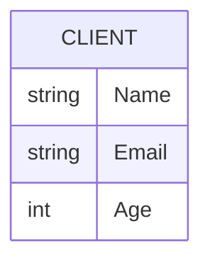
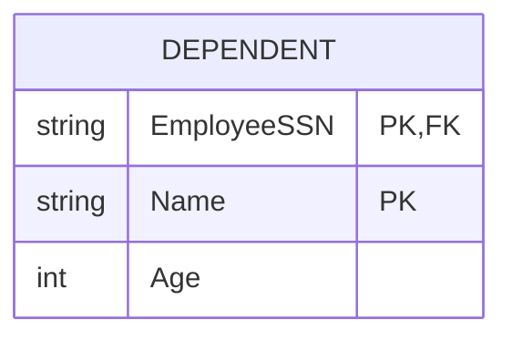
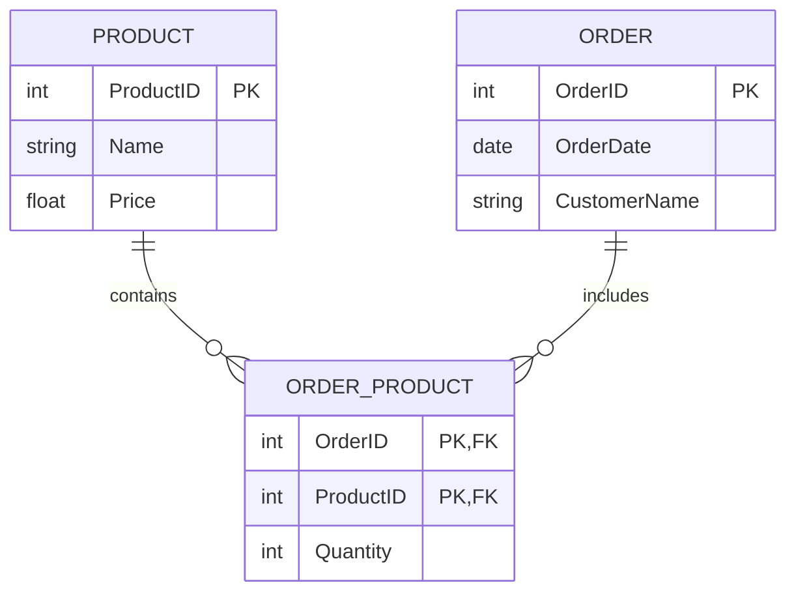
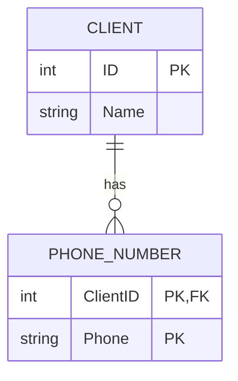
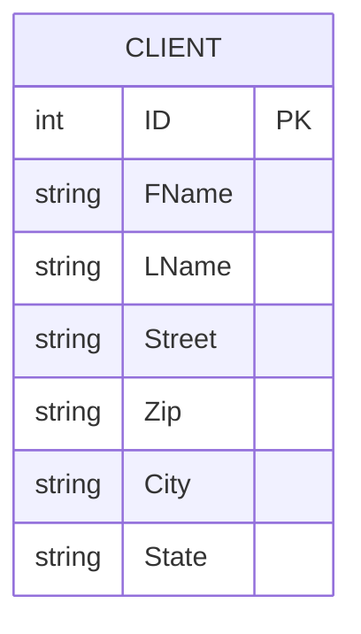
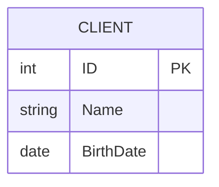
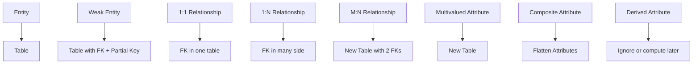
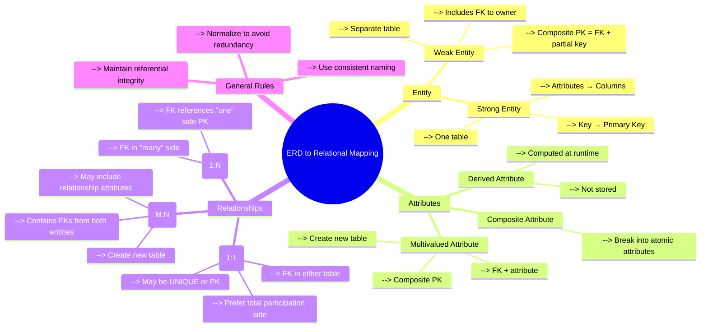
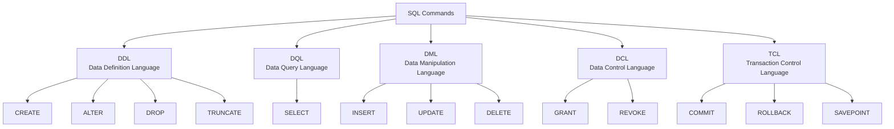

### Table of Contents

1. [Mapping ERD to Relational Schema](#mapping-erd-to-relational-schema)
2. [SQL - Structured Query Language](#sql)
3. [SQL Data Types](#sql-data-types)
4. [SQL Server – Clauses](#sql-server--clauses)

---

### Mapping ERD to Relational Schema

##### This term refers to the process of converting an ERB schema into database tables

### 1. **Entity → Table**

**Rule:** Each strong entity becomes a table.

**Columns:** Attributes of the entity become columns.

**Primary Key:** The entity's key becomes the table's primary key.

#### Example:




### 2.**Weak Entity → Table**

**Rule:** Weak entity becomes a separate table, including:

Partial key

Foreign key to owner entity

Composite PK = (FK + partial key)

#### Example:




### 3.**1:1 Relationship → FK in Either Table**

**Rule:** Choose one of the two entities and add the FK to reference the other.

**Also:** Mark the FK as **UNIQUE** or even PK if total participation.

#### Example:

.png>)

**Relationship**: Manage 1:1
→ Add **EmployeeID** as FK in Department table.

### 4. **1:N Relationship → FK in "Many" Side**

**Rule:** Add the PK of the "1" side as FK in the "N" side.

#### Example:


→ Add **DNum** in Employee Table as references for Department.

### 5. **M:N Relationship → New Table**

**Rule:** Create a separate table with:

PKs of both participating entities as FKs

Any relationship attributes

#### Example:

%201.png>)



### 6. **Multivalued Attribute → Separate Table**

**Rule:** Create a new table with:

The entity's PK

The multivalued attribute

Composite PK

#### Example:




---

### 7. **Composite Attribute → Flatten it**

**Rule:** Split into simple attributes.

#### Example:




---

### 8. **Derived Attribute → Ignore or compute in query**

**Rule:** Don't store it; compute using SQL when needed.

#### Example:




### **Summary**



---

### **Mapping Flow Summary**



---

## SQL

**Structured Query Language (SQL) is the standard language used to interact with relational databases. Whether you want to create, delete, update or read data, SQL provides the structure and commands to perform these operations. SQL is widely supported across various database systems like MySQL, Oracle, PostgreSQL, SQL Server and many others.**

### What are SQL Commands?

**SQL commands are the fundamental building blocks for communicating with a database management system (DBMS). It is used to interact with the database with some operations.**

### Transact-SQL (T-SQL)

**T-SQL is divided into five categories:**

- **DDL** – Data Definition Language
- **DQL** – Data Query Language
- **DML** – Data Manipulation Language
- **DCL** – Data Control Language
- **TCL** - Transaction Control Language



### 1. DDL - Data Definition Language

DDL or Data Definition Language actually consists of the SQL commands that can be used for defining, altering and deleting database structures such as tables, indexes and schemas.

| Command                   | Description                                                                   | Example                                               |
| ------------------------- | ----------------------------------------------------------------------------- | ----------------------------------------------------- |
| `CREATE`                  | Creates a new table, view, database, index, or other object in the database   | `CREATE TABLE Students (ID INT, Name VARCHAR(50));`   |
| `ALTER`                   | Modifies an existing database object (e.g., add/drop column, change datatype) | `ALTER TABLE Students ADD Age INT;`                   |
| `DROP`                    | Deletes an existing database object permanently                               | `DROP TABLE Students;`                                |
| `TRUNCATE`                | Removes all rows from a table without logging individual row deletions        | `TRUNCATE TABLE Students;`                            |
| `RENAME` _(some systems)_ | Renames a database object (table, column, etc.)                               | `ALTER TABLE Students RENAME TO Pupils;`              |
| `COMMENT` _(optional)_    | Adds a comment to a table or column (mainly in Oracle/PostgreSQL)             | `COMMENT ON TABLE Students IS 'Stores student data';` |

> **Notes:**
>
> - They directly affect the structure of the database schema.

### 2. DQL - Data Query Language

DQL statements are used for performing queries on the data within schema objects. The purpose of the DQL Command is to get some schema relation based on the query passed to it

| Command  | Description                            | Example                   |
| -------- | -------------------------------------- | ------------------------- |
| `SELECT` | Retrieves data from one or more tables | `SELECT * FROM Students;` |

> DQL is **read-only** — it doesn't modify data.

```SQL
SELECT first_name, last_name, hire_date
FROM employees
WHERE department = 'Sales'
ORDER BY hire_date DESC;
```

### 3. DML - Data Manipulation Language

The SQL commands that deal with the manipulation of data present in the database belong to DML or Data Manipulation Language and this includes most of the SQL statements. It is the component of the SQL statement that controls access to data and to the database.

| Command              | Description                                              | Example                                              |
| -------------------- | -------------------------------------------------------- | ---------------------------------------------------- |
| `INSERT`             | Adds new rows of data to a table                         | `INSERT INTO Students (ID, Name) VALUES (1, 'Ali');` |
| `UPDATE`             | Modifies existing data in a table                        | `UPDATE Students SET Name = 'Omar' WHERE ID = 1;`    |
| `DELETE`             | Removes existing rows from a table                       | `DELETE FROM Students WHERE ID = 1;`                 |
| `MERGE` _(optional)_ | Combines `INSERT`, `UPDATE`, and `DELETE` in one command | `MERGE INTO Students USING NewData ON ...`           |

> **Note**: DML changes **do not auto-commit** — you must use `COMMIT`.

```SQL
INSERT INTO employees (first_name, last_name, department)
VALUES ('Jane', 'Smith', 'HR');
```

### 4. DCL - Data Control Language

DCL (Data Control Language) includes commands such as **GRANT** and **REVOKE** which mainly deal with the rights, permissions and other controls of the database system.

| Command  | Description                              | Example                                 |
| -------- | ---------------------------------------- | --------------------------------------- |
| `GRANT`  | Gives a user privileges or access rights | `GRANT SELECT ON Students TO Karim;`    |
| `REVOKE` | Removes previously granted privileges    | `REVOKE SELECT ON Students FROM Karim;` |

> DCL is used mostly by **admins** or **privileged users**.

```SQL
GRANT SELECT, UPDATE ON employees TO user_name;
```

### 5. TCL - Transaction Control Language

Transactions group a set of tasks into a single execution unit. Each transaction begins with a specific task and ends when all the tasks in the group are successfully completed. If any of the tasks fail, the transaction fails. Therefore, a transaction has only two results: success or failure.

| Command           | Description                                                         | Example                      |
| ----------------- | ------------------------------------------------------------------- | ---------------------------- |
| `COMMIT`          | Saves all changes made during the transaction                       | `COMMIT;`                    |
| `ROLLBACK`        | Undoes changes made in the current transaction                      | `ROLLBACK;`                  |
| `SAVEPOINT`       | Sets a point to which a transaction can roll back without full undo | `SAVEPOINT sp1;`             |
| `SET TRANSACTION` | Sets properties for the current transaction (e.g., isolation level) | `SET TRANSACTION READ ONLY;` |

> TCL works with **DML** to ensure data integrity in multi-step operations.

```SQL
BEGIN TRANSACTION;
UPDATE employees SET department = 'Marketing' WHERE department = 'Sales';
SAVEPOINT before_update;
UPDATE employees SET department = 'IT' WHERE department = 'HR';
ROLLBACK TO SAVEPOINT before_update;
COMMIT;
```

---

## SQL Data Types

###

**Data types** in SQL define the kind of data that can be stored in a table column — such as numbers, text, dates, etc. Choosing the correct data type is crucial for:

- Ensuring **data integrity**
- Optimizing **performance**
- Saving **storage space**

Each database system (SQL Server, PostgreSQL, MySQL...) may support different data types or have slight variations.

###

| Category           | Data Type               | Description                                       | Example Value             |
| ------------------ | ----------------------- | ------------------------------------------------- | ------------------------- |
| **Numeric**        | `INT`                   | Integer number (whole number)                     | `42`                      |
|                    | `BIGINT`                | Large integer                                     | `9223372036854775807`     |
|                    | `SMALLINT`              | Smaller range integer                             | `-32768`                  |
|                    | `DECIMAL(p,s)`          | Fixed precision number (p = precision, s = scale) | `1234.56`                 |
|                    | `FLOAT`                 | Approximate floating-point number                 | `3.14159`                 |
|                    | `BIT`                   | Boolean (`0` or `1`)                              | `1`                       |
| **Character/Text** | `CHAR(n)`               | Fixed-length string                               | `'ABC'`                   |
|                    | `VARCHAR(n)`            | Variable-length string                            | `'Hello'`                 |
|                    | `TEXT`                  | Large text data (deprecated in new versions)      | `'Long message...'`       |
| **Date/Time**      | `DATE`                  | Date only                                         | `2025-06-29`              |
|                    | `DATETIME`              | Date and time                                     | `2025-06-29 14:30:00`     |
|                    | `TIME`                  | Time only                                         | `14:30:00`                |
| **Binary**         | `BINARY(n)`             | Fixed-length binary data                          | `0xAB`                    |
|                    | `VARBINARY(n)`          | Variable-length binary data                       | `0xABCD1234`              |
| **Other**          | `UNIQUEIDENTIFIER`      | Globally unique identifier (GUID)                 | `6F9619FF-8B86...`        |
|                    | `XML`                   | Stores XML data                                   | `<data><n>Ali</n></data>` |
|                    | `JSON` _(via NVARCHAR)_ | JSON is stored as string (no native JSON type)    | `'{"id":1,"name":"Ali"}'` |

###

| Type            | Fixed or Variable Length | Max Size                                | Unicode Support | When to Use                                                   |
| --------------- | ------------------------ | --------------------------------------- | --------------- | ------------------------------------------------------------- |
| `CHAR(n)`       | **Fixed-length**         | Up to 8,000 chars                       | (non-Unicode)   | Data of consistent size (e.g., country codes: `'EG'`, `'US'`) |
| `VARCHAR(n)`    | **Variable-length**      | Up to 8,000 chars\*                     | (non-Unicode)   | Most text where size may vary (names, emails, etc.)           |
| `NVARCHAR(n)`   | **Variable-length**      | Up to 4,000 Unicode chars (8,000 bytes) | Yes             | Multilingual text (Arabic, Chinese, emojis)                   |
| `TEXT`          | Variable-length (LOB)    | Up to 2GB                               | (non-Unicode)   | Deprecated — use `VARCHAR(MAX)` instead                       |
| `VARCHAR(MAX)`  | Variable-length (LOB)    | Up to 2GB (2^31-1)                      |                 | Long text like articles, logs, JSON                           |
| `NVARCHAR(MAX)` | Variable-length (LOB)    | Up to 1GB Unicode text                  | Yes             | Long multilingual content                                     |

**Note**:

- SQL Server doesn't have a native `BOOLEAN` type — it uses `BIT`.
- Always **choose the smallest data type** that fits your need (for performance).

---

## SQL Server – Clauses

### SELECT

To retrieve data from a table, you use the **SELECT** statement

```SQL
SELECT select_list
FROM schema_name.table_name;
```

SQL Server first processes the **FROM** clause, followed by the **SELECT** clause, even though the**SELECT** clause appears before the **FROM**

```SQL
SELECT first_name, last_name
FROM sales.customers;
```

> **_FROM_** **==>** **_SELECT_**

### WHERE

To filter rows based on one or more conditions, you use a **WHERE** clause.

```SQL
SELECT *
FROM sales.customers
WHERE state = 'CA';
```

> **_FROM_** **==>** **_WHERE_** **==>** **_SELECT_**

### ORDER BY

To sort rows in a result set based, you use the **ORDER BY** clause.

```SQL
SELECT *
FROM sales.customers
WHERE state = 'CA'
ORDER BY first_name;
```

> **_FROM_** **==>** **_WHERE_** **==>** **_SELECT_** **==>** **_ORDER BY_**

### GROUP BY

To group rows into groups, you use the **GROUP BY** clause.

```SQL
SELECT city, COUNT (*)
FROM sales.customers
WHERE state = 'CA'
GROUP BY city
ORDER BY city;
```

> **_FROM_** **==>** **_WHERE_** **==>** **_GROUP BY_** **==>** **_SELECT_** **==>** **_ORDER BY_**

### HAVING

To filter groups based on one or more conditions, you use the **HAVING** clause.

```SQL
SELECT city, COUNT (*)
FROM sales.customers
WHERE state = 'CA'
GROUP BY city
HAVING COUNT (*) > 10
ORDER BY city;
```

> **Note**
> that the **WHERE** clause filters rows while the **HAVING** clause filter groups.
