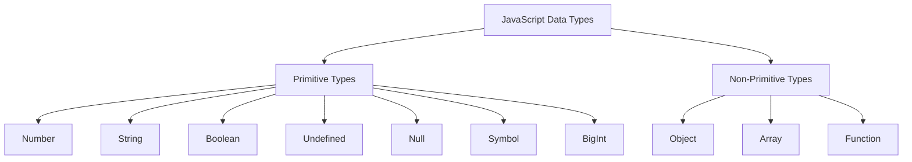

# JavaScript Variables and Data Types

Welcome to your first lesson on JavaScript fundamentals! In this lecture, we'll explore how to declare variables and work with different data types.

## What are Variables?

Variables are containers that store data values. Think of them as labeled boxes where you can put different types of information.

```javascript
// Declaring variables
let message = 'Hello, World!';
let count = 42;
let isActive = true;
```

## Variable Declaration Keywords

JavaScript provides three ways to declare variables:

### `var` - The Old Way

```javascript
var name = 'Alice';
var age = 25;

// Function-scoped and can be redeclared
var name = 'Bob'; // This works but is not recommended
```

### `let` - Block-Scoped Variable

```javascript
let score = 100;

if (score > 50) {
  let bonus = 10; // Only accessible within this block
  console.log(score + bonus);
}
// console.log(bonus); // Error: bonus is not defined
```

### `const` - Constants

```javascript
const PI = 3.14159;
const API_URL = 'https://api.example.com';

// PI = 3.14; // Error: Cannot reassign a const variable
```

## Data Types in JavaScript

JavaScript has several built-in data types:



### Primitive Data Types

#### Numbers

```javascript
let integer = 42;
let decimal = 3.14;
let negative = -10;
let exponential = 2e3; // 2000
```

#### Strings

```javascript
let singleQuotes = 'Hello';
let doubleQuotes = 'World';
let templateLiterals = `Hello, ${name}!`;
let multiLine = `This is a
multi-line string`;
```

#### Booleans

```javascript
let isLoggedIn = true;
let hasPermission = false;
let isAdult = age >= 18; // Boolean expression
```

#### Undefined and Null

```javascript
let undefinedVariable; // undefined
let emptyValue = null; // null (intentionally empty)
```

### Non-Primitive Data Types

#### Objects

```javascript
let person = {
  name: 'Alice',
  age: 30,
  city: 'New York',
};
```

#### Arrays

```javascript
let colors = ['red', 'green', 'blue'];
let numbers = [1, 2, 3, 4, 5];
let mixed = ['hello', 42, true, null];
```

## Variable Naming Rules

Follow these rules when naming variables:

- Start with a letter, underscore (\_), or dollar sign ($)
- Can contain letters, numbers, underscores, and dollar signs
- Case-sensitive (`myVar` and `myvar` are different)
- Cannot use reserved keywords

### Good Variable Names

```javascript
let userName = 'alice123';
let totalPrice = 99.99;
let isEmailValid = true;
let user_id = 12345;
let $element = document.getElementById('header');
```

### Bad Variable Names

```javascript
// let 123name = "invalid"; // Cannot start with number
// let user-name = "invalid"; // Cannot contain hyphens
// let class = "invalid"; // Cannot use reserved keywords
```

## Best Practices

> **Remember**: Good variable names make your code self-documenting and easier to understand.

1. **Use descriptive names**

   ```javascript
   // Bad
   let x = 25;

   // Good
   let userAge = 25;
   ```

2. **Use camelCase for variables**

   ```javascript
   let firstName = 'John';
   let lastLoginDate = new Date();
   ```

3. **Use const for values that won't change**

   ```javascript
   const MAX_USERS = 100;
   const COMPANY_NAME = 'TechCorp';
   ```

4. **Initialize variables when possible**

   ```javascript
   // Good
   let count = 0;
   let items = [];

   // Avoid when possible
   let count;
   let items;
   ```

## Quick Exercise

Try declaring variables for the following scenarios:

| Scenario             | Variable Type | Example                                       |
| -------------------- | ------------- | --------------------------------------------- |
| User's email address | `let`         | `let userEmail = "user@example.com";`         |
| Maximum file size    | `const`       | `const MAX_FILE_SIZE = 1024 * 1024;`          |
| Is user logged in?   | `let`         | `let isLoggedIn = false;`                     |
| API endpoint URL     | `const`       | `const API_BASE_URL = "https://api.app.com";` |

## Summary

In this lesson, you learned:

- How to declare variables using `var`, `let`, and `const`
- The difference between primitive and non-primitive data types
- Variable naming conventions and best practices
- How to choose the right declaration keyword for different scenarios

Next up, we'll explore functions and how to organize your code into reusable blocks!
