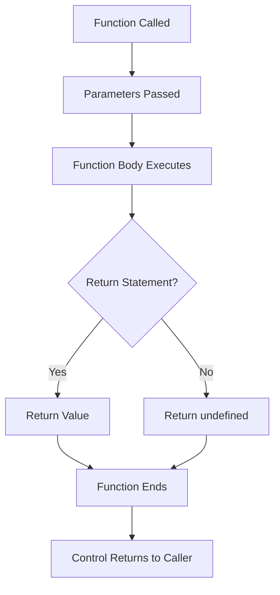

# JavaScript Functions

Functions are one of the fundamental building blocks in JavaScript. They allow you to encapsulate code into reusable blocks, making your programs more organized and efficient.

## What is a Function?

A function is a block of code designed to perform a particular task. It's like a recipe that you can use over and over again with different ingredients (parameters) to create different results.

```javascript
// A simple function
function greet() {
  console.log("Hello, World!");
}

// Call the function
greet(); // Output: "Hello, World!"
```

## Function Declaration

The most common way to create a function is using a **function declaration**:

```javascript
function functionName(parameters) {
  // Code to execute
  return result; // Optional
}
```

### Example: Basic Function
```javascript
function sayHello(name) {
  return `Hello, ${name}!`;
}

// Using the function
let message = sayHello("Alice");
console.log(message); // Output: "Hello, Alice!"
```

## Function Expressions

You can also create functions using **function expressions**:

```javascript
// Function expression
const greet = function(name) {
  return `Hi, ${name}!`;
};

// Anonymous function assigned to a variable
const add = function(a, b) {
  return a + b;
};

console.log(add(5, 3)); // Output: 8
```

## Arrow Functions (ES6)

Arrow functions provide a more concise syntax:

```javascript
// Traditional function
function multiply(a, b) {
  return a * b;
}

// Arrow function equivalent
const multiply = (a, b) => {
  return a * b;
};

// Even shorter for single expressions
const multiply = (a, b) => a * b;

// Single parameter (parentheses optional)
const square = x => x * x;

// No parameters
const getRandom = () => Math.random();
```

## Function Flow Diagram



## Parameters and Arguments

**Parameters** are variables listed in the function definition. **Arguments** are the actual values passed to the function.

```javascript
function calculateArea(width, height) { // Parameters
  return width * height;
}

let area = calculateArea(10, 5); // Arguments: 10 and 5
console.log(area); // Output: 50
```

### Default Parameters
```javascript
function greet(name = "Guest", time = "day") {
  return `Good ${time}, ${name}!`;
}

console.log(greet()); // "Good day, Guest!"
console.log(greet("Alice")); // "Good day, Alice!"
console.log(greet("Bob", "morning")); // "Good morning, Bob!"
```

### Rest Parameters
```javascript
function sum(...numbers) {
  return numbers.reduce((total, num) => total + num, 0);
}

console.log(sum(1, 2, 3)); // 6
console.log(sum(1, 2, 3, 4, 5)); // 15
```

## Return Values

Functions can return values using the `return` statement:

```javascript
function calculateTax(price, taxRate = 0.08) {
  const tax = price * taxRate;
  return {
    price: price,
    tax: tax,
    total: price + tax
  };
}

const purchase = calculateTax(100, 0.1);
console.log(purchase);
// Output: { price: 100, tax: 10, total: 110 }
```

## Function Scope

Variables declared inside a function have **local scope** and are only accessible within that function:

```javascript
let globalVar = "I'm global";

function demonstrateScope() {
  let localVar = "I'm local";

  console.log(globalVar); // Accessible
  console.log(localVar);  // Accessible
}

demonstrateScope();
// console.log(localVar); // Error: localVar is not defined
```

### Scope Chain Example
```javascript
let level1 = "Global";

function outerFunction() {
  let level2 = "Outer";

  function innerFunction() {
    let level3 = "Inner";

    console.log(level1); // "Global"
    console.log(level2); // "Outer"
    console.log(level3); // "Inner"
  }

  innerFunction();
}

outerFunction();
```

## Higher-Order Functions

Functions that take other functions as parameters or return functions:

```javascript
// Function that takes another function as parameter
function processNumbers(numbers, operation) {
  return numbers.map(operation);
}

const numbers = [1, 2, 3, 4, 5];
const squared = processNumbers(numbers, x => x * x);
console.log(squared); // [1, 4, 9, 16, 25]

// Function that returns another function
function createMultiplier(factor) {
  return function(number) {
    return number * factor;
  };
}

const double = createMultiplier(2);
const triple = createMultiplier(3);

console.log(double(5)); // 10
console.log(triple(5)); // 15
```

## Common Function Patterns

### Immediately Invoked Function Expression (IIFE)
```javascript
(function() {
  console.log("This runs immediately!");
})();

// Arrow function IIFE
(() => {
  console.log("Arrow IIFE!");
})();
```

### Callback Functions
```javascript
function fetchData(callback) {
  // Simulate async operation
  setTimeout(() => {
    const data = { id: 1, name: "Alice" };
    callback(data);
  }, 1000);
}

fetchData(function(data) {
  console.log("Received:", data);
});
```

## Function Comparison Table

| Feature | Function Declaration | Function Expression | Arrow Function |
|---------|---------------------|-------------------|----------------|
| Hoisting | ✅ Yes | ❌ No | ❌ No |
| `this` binding | Dynamic | Dynamic | Lexical |
| Constructor | ✅ Yes | ✅ Yes | ❌ No |
| Arguments object | ✅ Yes | ✅ Yes | ❌ No |
| Syntax | Verbose | Medium | Concise |

## Best Practices

1. **Use descriptive names**
   ```javascript
   // Bad
   function calc(x, y) { return x * y; }

   // Good
   function calculateArea(width, height) { return width * height; }
   ```

2. **Keep functions small and focused**
   ```javascript
   // Good - Single responsibility
   function validateEmail(email) {
     return email.includes('@') && email.includes('.');
   }

   function formatEmail(email) {
     return email.toLowerCase().trim();
   }
   ```

3. **Use arrow functions for short operations**
   ```javascript
   // Good use of arrow functions
   const numbers = [1, 2, 3, 4, 5];
   const doubled = numbers.map(n => n * 2);
   const evens = numbers.filter(n => n % 2 === 0);
   ```

4. **Handle edge cases**
   ```javascript
   function divide(a, b) {
     if (b === 0) {
       throw new Error("Cannot divide by zero");
     }
     return a / b;
   }
   ```

## Practical Example: Calculator

Let's build a simple calculator using functions:

```javascript
const calculator = {
  add: (a, b) => a + b,
  subtract: (a, b) => a - b,
  multiply: (a, b) => a * b,
  divide: (a, b) => b !== 0 ? a / b : "Cannot divide by zero",

  calculate(operation, a, b) {
    if (typeof this[operation] === 'function') {
      return this[operation](a, b);
    }
    return "Unknown operation";
  }
};

console.log(calculator.calculate('add', 10, 5));      // 15
console.log(calculator.calculate('multiply', 4, 3));  // 12
console.log(calculator.calculate('divide', 10, 0));   // "Cannot divide by zero"
```

## Summary

Functions are essential for:
- **Code reusability**: Write once, use many times
- **Organization**: Break complex problems into smaller pieces
- **Abstraction**: Hide implementation details
- **Modularity**: Create independent, testable units

### Key Takeaways:
- Functions can be declared, expressed, or written as arrows
- Parameters make functions flexible and reusable
- Scope determines variable accessibility
- Higher-order functions enable powerful programming patterns
- Good function design improves code quality

Next up: We'll explore objects and how to organize related data and functions together!
